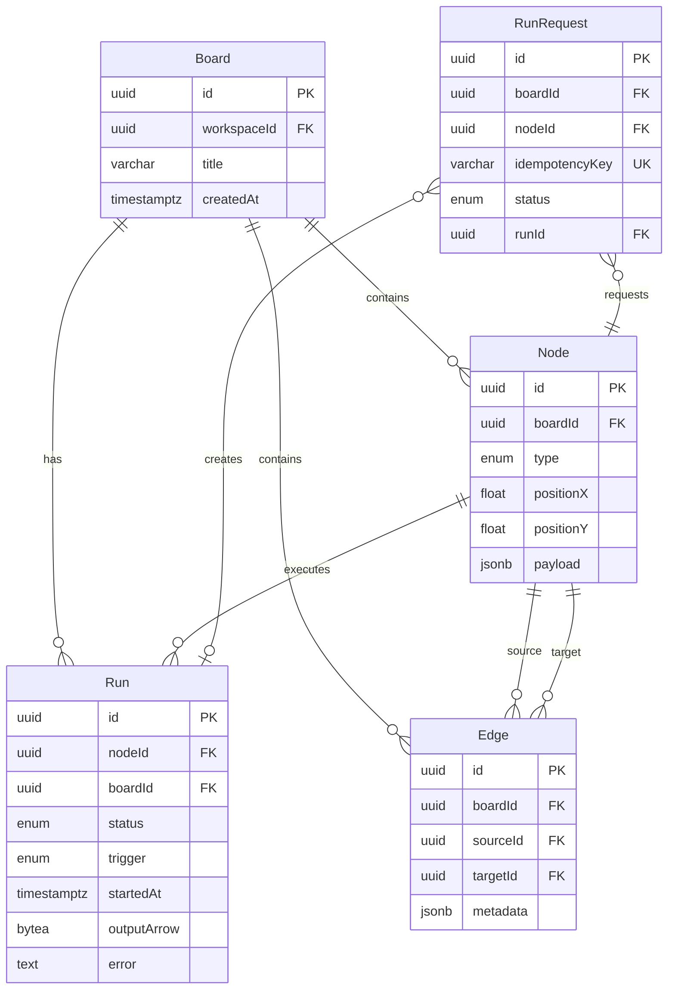

# План проекта 1: Workyy — Аналитические пайплайны и выполнение узлов

> **Фокус проекта**: Проектирование и требования к функциональности создания аналитических пайплайнов, выполнения SQL/Python узлов, визуализации данных и управления зависимостями между узлами в платформе Workyy.

---

## 1. Сфера деятельности ПАО «Workyy»

### 1.1. Протокол интервью с заказчиком

**Дата проведения**: [Указать дату]  
**Участники**: 
- Заказчик: [ФИО, должность]
- Аналитик: [ФИО]
- Разработчик: [ФИО]

**Ключевые вопросы и ответы**:

1. **Вопрос**: Какие основные задачи решает платформа Workyy для пользователей?
   - **Ответ**: Платформа позволяет аналитикам и дата-сайентистам создавать интерактивные пайплайны обработки данных, выполнять SQL-запросы и Python-скрипты, визуализировать результаты на едином холсте.

2. **Вопрос**: Какие типы узлов должны поддерживаться в системе?
   - **Ответ**: SQL-узлы для запросов к базам данных, Python-узлы для сложных вычислений и трансформаций, узлы визуализации (таблицы, графики), узлы для работы с данными.

3. **Вопрос**: Как должна работать система выполнения узлов?
   - **Ответ**: Узлы выполняются в браузере (SQL через DuckDB-WASM, Python через Pyodide), результаты сохраняются в формате Arrow, система должна поддерживать зависимости между узлами (DAG).

**Выявленные требования**:
- Поддержка SQL и Python узлов
- Выполнение узлов в браузере
- Управление зависимостями между узлами
- Визуализация результатов выполнения

**Договорённости**:
- Использование формата Arrow для передачи данных между узлами
- Поддержка идемпотентности выполнения через idempotency-key
- Асинхронное выполнение узлов с отслеживанием статуса

### 1.2. Обзорная информация о компании

**Workyy** — браузерная платформа аналитики на бесконечном холсте, разрабатываемая для команд аналитиков и дата-сайентистов. Платформа объединяет возможности интерактивных ноутбуков и BI-инструментов, позволяя создавать аналитические пайплайны из SQL и Python узлов с визуализацией результатов.

**Основные бизнес-процессы**:
- Создание аналитических досок (boards) с узлами обработки данных
- Выполнение SQL-запросов к подключенным базам данных
- Выполнение Python-скриптов для трансформации и анализа данных
- Визуализация результатов в виде таблиц и графиков
- Управление зависимостями между узлами (DAG)

**Рынок и позиция**:
Workyy позиционируется как альтернатива традиционным BI-инструментам и ноутбукам, объединяя их преимущества в единой платформе с реалтайм коллаборацией.

**Источники**: 
- Официальный репозиторий проекта: `workyy-fullproject-stable`
- Документация в `docs/`
- README.md проекта

### 1.3. Регуляторные ограничения

1. **Закон №152-ФЗ «О персональных данных»** (ст. 18.1, 19)
   - **Влияние**: Система должна обеспечивать безопасное хранение и обработку персональных данных пользователей. При выполнении SQL-запросов к базам данных с ПДн необходимо обеспечить логирование доступа и контроль прав доступа.

2. **Закон №149-ФЗ «Об информации, информационных технологиях и о защите информации»** (ст. 10.1)
   - **Влияние**: Требования к локализации данных. Результаты выполнения узлов, содержащие данные российских пользователей, должны храниться на серверах, расположенных на территории РФ.

3. **ГОСТ Р 57580.1-2017 «Безопасность финансовых (банковских) операций»** (при работе с финансовыми данными)
   - **Влияние**: При выполнении аналитических запросов к финансовым данным необходимо обеспечить аудит всех операций выполнения узлов, контроль целостности данных и защиту от несанкционированного доступа.

### 1.4. Стейкхолдеры и оргструктура

| Роль/Должность | Описание вклада и интересов в проекте | Степень влияния |
| --- | --- | --- |
| Product Owner | Определяет приоритеты функциональности выполнения узлов, утверждает требования к производительности системы выполнения | High |
| Lead Backend Developer | Отвечает за архитектуру системы выполнения узлов, выбор технологий (DuckDB-WASM, Pyodide), оптимизацию производительности | High |
| Frontend Developer | Реализует UI для создания узлов, отображения результатов выполнения, управления зависимостями | Medium |
| Data Engineer | Предоставляет требования к форматам данных, интеграции с базами данных, производительности выполнения запросов | Medium |
| QA Engineer | Тестирует функциональность выполнения узлов, проверяет корректность обработки ошибок, производительность | Low |
| End User (Аналитик) | Использует систему для создания пайплайнов, предоставляет обратную связь по удобству использования | Medium |

**Фрагмент оргструктуры**:
```
Product Owner
├── Lead Backend Developer
│   └── Backend Team
├── Frontend Developer
│   └── Frontend Team
└── Data Engineer
    └── QA Engineer
```

### 1.5. Описание методов анализа

Для подготовки разделов 1.1-1.4 использовались следующие методы анализа:

1. **Интервью с ключевыми стейкхолдерами** (раздел 1.1)
   - Метод: Структурированные интервью с Product Owner и разработчиками
   - Обоснование: Позволило выявить ключевые требования к функциональности выполнения узлов напрямую от заинтересованных сторон

2. **Анализ документации проекта** (раздел 1.2)
   - Метод: Изучение README.md, архитектурной документации, кодовой базы
   - Обоснование: Позволило получить точное понимание текущей реализации и бизнес-процессов

3. **Анализ нормативных документов** (раздел 1.3)
   - Метод: Изучение федеральных законов и стандартов, релевантных для обработки данных
   - Обоснование: Необходимо для обеспечения соответствия системы регуляторным требованиям

4. **User Story Mapping** (для выявления требований)
   - Метод: Визуализация пользовательских историй создания и выполнения узлов
   - Обоснование: Помогло структурировать функциональные требования и выявить зависимости

---

## 2. Протокол интервью с заказчиком

*См. раздел 1.1*

---

## 3. Обзорная информация о компании

*См. раздел 1.2*

---

## 4. Регуляторные ограничения

*См. раздел 1.3*

---

## 5. Стейкхолдеры и оргструктура

*См. раздел 1.4*

---

## 6. Описание методов анализа

*См. раздел 1.5*

---

## 7. Основные проблемы и пути решения

### Проблема 1: Отсутствие единой платформы для создания аналитических пайплайнов

**Что?** Аналитики вынуждены использовать несколько инструментов (SQL-клиенты, Python-ноутбуки, BI-инструменты) для создания аналитических пайплайнов, что приводит к потере контекста и сложности воспроизведения результатов.

**Где?** В процессе работы аналитиков и дата-сайентистов при создании аналитических отчётов и дашбордов.

**Почему это проблема?** 
- Необходимость переключения между инструментами замедляет работу
- Сложность отслеживания зависимостей между шагами анализа
- Невозможность визуализации всего пайплайна на одном холсте
- Трудности с воспроизведением результатов из-за разрозненности инструментов

**Решение**: Разработка единой платформы Workyy с поддержкой SQL и Python узлов на едином холсте.

**SMART-цели**:
1. **Метрика**: Время создания аналитического пайплайна из 5 узлов
   - **Целевое значение**: Сокращение с 2 часов до 30 минут
   - **Срок**: 3 месяца после запуска
   
2. **Метрика**: Процент успешно воспроизведённых пайплайнов
   - **Целевое значение**: 95% пайплайнов воспроизводятся без ошибок
   - **Срок**: 6 месяцев после запуска

### Проблема 2: Низкая производительность выполнения узлов в браузере

**Что?** Выполнение SQL-запросов и Python-скриптов в браузере может быть медленным при работе с большими объёмами данных, что снижает продуктивность аналитиков.

**Где?** В процессе выполнения узлов на платформе Workyy.

**Почему это проблема?**
- Долгое ожидание результатов выполнения снижает продуктивность
- Ограничения браузерной среды по обработке данных
- Необходимость оптимизации передачи данных между узлами

**Решение**: Оптимизация выполнения узлов через использование DuckDB-WASM для SQL, Pyodide для Python, формата Arrow для эффективной передачи данных.

**SMART-цели**:
1. **Метрика**: Время выполнения SQL-узла с запросом к 1M строк
   - **Целевое значение**: Не более 5 секунд
   - **Срок**: 2 месяца после оптимизации
   
2. **Метрика**: Пропускная способность передачи данных между узлами
   - **Целевое значение**: 100MB данных передаются между узлами за не более 2 секунд
   - **Срок**: 3 месяца после оптимизации

---

## 8. Модель жизненного цикла

### Выбранная методология: Agile (Scrum)

**Обоснование выбора**:
1. **Итеративная разработка**: Позволяет быстро получать обратную связь от пользователей по функциональности выполнения узлов и вносить корректировки
2. **Гибкость требований**: Требования к функциональности выполнения узлов могут изменяться по мере понимания потребностей пользователей
3. **Непрерывная интеграция**: Необходима для обеспечения стабильности системы выполнения узлов при частых обновлениях

### 8.1. Этапы жизненного цикла в Agile (Scrum)

| Этап | Описание | Результаты |
| --- | --- | --- |
| Инициация | Формирование продукт-бэклога, определение спринта, выбор задач по выполнению узлов | Product Backlog, Sprint Backlog |
| Планирование спринта | Декомпозиция задач, оценка сложности, распределение между разработчиками | Sprint Plan, оценка story points |
| Разработка | Реализация функциональности выполнения узлов, написание тестов | Код, unit-тесты, интеграционные тесты |
| Ежедневные стендапы | Синхронизация команды, обсуждение блокеров | Обновлённый статус задач |
| Тестирование | Проверка функциональности выполнения узлов, производительности | Test Report, баг-репорты |
| Ретроспектива | Анализ прошедшего спринта, выявление улучшений | Action Items для следующего спринта |
| Релиз | Деплой новой функциональности на staging/production | Release Notes, обновлённая документация |
| Сопровождение | Мониторинг работы системы выполнения узлов, исправление багов | Hotfixes, улучшения производительности |

### 8.2. Сравнение методологии с другими

| Критерий | Agile (Scrum) | Waterfall | Kanban |
| --- | --- | --- | --- |
| Гибкость | Высокая — легко адаптироваться к изменениям требований | Низкая — сложно вносить изменения после начала разработки | Средняя — изменения возможны, но требуют перепланирования |
| Скорость доставки | Быстрая — релизы каждые 2-4 недели | Медленная — релиз только после завершения всех этапов | Средняя — непрерывная доставка |
| Управление рисками | Раннее выявление проблем через итерации | Риски выявляются поздно | Постоянный мониторинг |
| Подходит для проекта | ✅ Да — требования могут изменяться | ❌ Нет — слишком жёсткая | ⚠️ Частично — подходит для поддержки |

### 8.3. Инструменты управления

Для эффективного управления задачами в рамках Agile (Scrum) выбран инструмент **YouTrack** (или аналог: Jira, Linear).

**Примечание**: Приложить скриншот разработанной Kanban-доски с колонками:
- Backlog
- To Do
- In Progress
- Code Review
- Testing
- Done

Доска заполнена релевантными задачами по функциональности выполнения узлов:
- "Реализовать выполнение SQL-узла через DuckDB-WASM"
- "Добавить поддержку Python-узлов через Pyodide"
- "Реализовать передачу данных между узлами в формате Arrow"
- "Добавить визуализацию результатов выполнения узлов"
- "Реализовать управление зависимостями между узлами (DAG)"

---

## 9. Функциональные требования (FR)

### FR1 — Создание и настройка SQL-узла

**Описание**: Пользователь может создать SQL-узел на доске, указать SQL-запрос, выбрать подключение к базе данных и настроить параметры выполнения.

**Детализация**:
- Создание SQL-узла через UI (перетаскивание или через меню)
- Редактирование SQL-запроса в текстовом редакторе с подсветкой синтаксиса
- Выбор подключения к базе данных из списка доступных подключений workspace
- Настройка параметров запроса (timeout, лимит строк)
- Сохранение узла на доске с позицией и настройками

**Проверяемость (acceptance criteria)**:
- SQL-узел создаётся на доске с уникальным ID
- SQL-запрос сохраняется в payload узла
- Выбранное подключение к БД сохраняется в метаданных узла
- Узел отображается на доске с иконкой SQL

### FR2 — Выполнение SQL-узла и получение результатов

**Описание**: Пользователь может запустить выполнение SQL-узла, система выполняет запрос к выбранной базе данных и возвращает результаты в формате Arrow.

**Детализация**:
- Запуск выполнения узла вручную (кнопка "Run") или автоматически при изменении зависимых узлов
- Выполнение SQL-запроса через DuckDB-WASM (для локальных данных) или через подключение к внешней БД
- Сохранение результатов выполнения в формате Arrow
- Отображение статуса выполнения (queued, running, succeeded, failed)
- Показ результатов в виде интерактивной таблицы под узлом
- Отображение ошибок выполнения с детальной информацией

**Проверяемость (acceptance criteria)**:
- При запуске создаётся Run с уникальным runId и idempotency-key
- Статус выполнения обновляется в реальном времени
- Результаты выполнения сохраняются в поле outputArrow в формате Arrow
- При ошибке выполнения сохраняется сообщение об ошибке в поле error
- Результаты отображаются в таблице с пагинацией (если строк > 100)

### FR3 — Создание и выполнение Python-узла

**Описание**: Пользователь может создать Python-узел, написать Python-код для трансформации данных и выполнить его, получив результаты.

**Детализация**:
- Создание Python-узла на доске
- Редактирование Python-кода в редакторе с подсветкой синтаксиса
- Доступ к результатам выполнения предыдущих узлов через переменные (например, `df1`, `df2`)
- Выполнение Python-кода через Pyodide в браузере
- Поддержка популярных библиотек (pandas, numpy, matplotlib)
- Сохранение результатов выполнения в формате Arrow
- Отображение результатов выполнения (таблицы, графики, текстовый вывод)

**Проверяемость (acceptance criteria)**:
- Python-узел создаётся на доске с уникальным ID
- Python-код сохраняется в payload узла
- При выполнении Python-код имеет доступ к результатам upstream-узлов
- Результаты выполнения сохраняются в формате Arrow
- Поддерживаются библиотеки pandas, numpy, matplotlib
- Ошибки выполнения отображаются с трассировкой стека

### FR4 — Управление зависимостями между узлами (DAG)

**Описание**: Пользователь может создавать связи между узлами, определяя зависимости данных. Система автоматически определяет порядок выполнения узлов на основе зависимостей.

**Детализация**:
- Создание связи (edge) между узлами через перетаскивание от source-узла к target-узлу
- Визуализация зависимостей на доске в виде стрелок
- Автоматическое определение порядка выполнения узлов на основе DAG
- Автоматический запуск зависимых узлов при изменении результатов upstream-узлов
- Валидация отсутствия циклических зависимостей
- Отображение статуса выполнения узлов в зависимости от статуса зависимых узлов

**Проверяемость (acceptance criteria)**:
- Связь между узлами создаётся с указанием sourceId и targetId
- При создании циклической зависимости система выдаёт предупреждение и блокирует создание связи
- При изменении результатов upstream-узла автоматически запускается выполнение downstream-узлов
- Порядок выполнения узлов соответствует топологическому порядку DAG
- Визуализация зависимостей отображается на доске в реальном времени

### FR5 — Визуализация результатов выполнения узлов

**Описание**: Пользователь может визуализировать результаты выполнения узлов в виде таблиц, графиков и других визуализаций.

**Детализация**:
- Автоматическое отображение результатов SQL-узла в виде интерактивной таблицы
- Создание узла визуализации (plot-узел) для построения графиков на основе данных из других узлов
- Поддержка различных типов графиков (линейные, столбчатые, круговые, scatter)
- Настройка параметров визуализации (оси, легенда, цвета)
- Экспорт визуализаций в изображения (PNG, SVG)
- Обновление визуализаций при изменении данных в source-узлах

**Проверяемость (acceptance criteria)**:
- Результаты SQL-узла отображаются в таблице с сортировкой и фильтрацией
- Plot-узел создаётся и связывается с source-узлом
- Графики строятся на основе данных из source-узла
- Визуализации обновляются при изменении данных в source-узлах
- Поддерживаются типы графиков: line, bar, pie, scatter

---

## 10. Нефункциональные требования (NFR / FURPS+)

### Reliability (Надёжность)

#### RL1
Система выполнения узлов обеспечивает успешное выполнение 95% SQL-запросов при стандартной нагрузке (до 100 одновременных выполнений узлов на одной доске).

#### RL2
При сбое выполнения узла система автоматически повторяет выполнение до 3 раз с экспоненциальной задержкой (1s, 2s, 4s) перед окончательным признанием ошибки.

#### RL3
Система обеспечивает сохранность результатов выполнения узлов: все успешно выполненные узлы сохраняют результаты в формате Arrow в течение минимум 7 дней или до следующего выполнения узла.

### Security (Безопасность)

#### SC1
Все SQL-запросы к внешним базам данных выполняются через защищённые соединения (SSL/TLS) с использованием учётных данных из зашифрованных секретов workspace.

#### SC2
Python-код выполняется в изолированной среде Pyodide без доступа к файловой системе браузера и сетевым ресурсам, кроме разрешённых API для получения данных из других узлов.

#### SC3
Доступ к выполнению узлов контролируется через систему авторизации workspace: только пользователи с ролью owner или editor могут запускать выполнение узлов на досках workspace.

### Performance (Производительность)

#### PF1
SQL-узел с запросом к локальной базе данных (DuckDB-WASM) на 100K строк выполняется не более чем за 2 секунды на стандартном оборудовании (Chrome на десктопе).

#### PF2
Python-узел с простой трансформацией данных (pandas) на 50K строк выполняется не более чем за 3 секунды в браузере.

#### PF3
Передача данных между узлами в формате Arrow для датасета размером 10MB происходит не более чем за 500ms.

### Usability (Удобство использования)

#### US1
Создание SQL-узла и выполнение запроса доступно пользователю максимум в 3 клика: создание узла → ввод запроса → запуск выполнения.

#### US2
Редактор SQL-кода поддерживает автодополнение ключевых слов SQL и подсветку синтаксиса для улучшения удобства написания запросов.

#### US3
Ошибки выполнения узлов отображаются в понятном для пользователя формате с указанием номера строки и типа ошибки, без технических деталей реализации.

### Supportability (Поддерживаемость)

#### SP1
Система логирует все операции выполнения узлов (запуск, завершение, ошибки) с указанием nodeId, runId, userId, timestamp для отладки проблем.

#### SP2
Система предоставляет метрики производительности выполнения узлов (среднее время выполнения, процент успешных выполнений) через административный интерфейс.

#### SP3
Документация по использованию SQL и Python узлов, форматам данных и API доступна в разделе Help платформы и обновляется при каждом релизе.

---

## 11. Проектирование REST-запроса

### Выбранное требование: FR2 — Выполнение SQL-узла и получение результатов

### 11.1. UI

#### UI-элементы, участвующие в формировании запроса

| UI-элемент | Описание |
| --- | --- |
| Кнопка "Run" на SQL-узле | При наведении отображается тултип "Выполнить SQL-запрос"<br>При нажатии отправляется запрос POST /runs с idempotency-key в заголовке |
| Поле выбора подключения к БД | Dropdown со списком доступных подключений workspace<br>Значение сохраняется в метаданных узла |

#### UI: отображение полученных данных

| Название атрибута на UI | Тип данных, размерность | Атрибут | Правило заполнения | Источник |
| --- | --- | --- | --- | --- |
| Статус выполнения (1) | String (20) | status | Отобразить: "В очереди", "Выполняется", "Успешно", "Ошибка" в зависимости от значения | POST /runs |
| Таблица результатов (2) | Array of Objects | [результаты из outputArrow] | Отобразить таблицу с пагинацией (100 строк на страницу)<br>При отсутствии данных показать сообщение "Нет данных" | GET /runs/{runId} |
| Время выполнения (3) | String (50) | finishedAt - startedAt | Отобразить в формате "Выполнено за 2.3 сек"<br>При отсутствии finishedAt показать "Выполняется..." | GET /runs/{runId} |
| Сообщение об ошибке (4) | String (1000) | error | Отобразить только при status = "failed"<br>Форматировать как предупреждение с иконкой | GET /runs/{runId} |

#### UI-сообщения

| UI-элемент | Описание |
| --- | --- |
| Тост "Узел выполнен успешно" | Отобразить при выполнении условий:<br>Получен HTTP код 202 в ответном сообщении POST /runs<br>Статус выполнения изменился на "succeeded" |
| Сообщение "Ошибка выполнения узла" | Отобразить при выполнении условий:<br>Получен HTTP код 202 в ответном сообщении POST /runs<br>Статус выполнения изменился на "failed"<br>Показать текст ошибки из поля error |
| Уведомление "Узел уже выполняется" | Отобразить при выполнении условий:<br>Получен HTTP код 409 в ответном сообщении POST /runs<br>Сообщение: "Этот узел уже выполняется" |

### 11.2. API

| Наименование | Описание |
| --- | --- |
| Цель | Запустить выполнение SQL-узла, получить результаты выполнения в формате Arrow |
| Источник | UI (кнопка "Run" на SQL-узле) |
| Потребитель | Run Service (сервис выполнения узлов) |
| Механизм обмена | 2-Way (request, response), асинхронный (запрос возвращает runId, статус получается через polling) |
| Способ взаимодействия | REST API |
| Метод | POST |
| URL | `/api/runs` |
| Формат запроса | JSON |

#### Входящее сообщение

| Контейнер | Атрибут | Тип данных | Размерность | Обязательность | Описание | Особенности заполнения |
| --- | --- | --- | --- | --- | --- | --- |
|  | nodeId | String (UUID) | 36 | O | Идентификатор SQL-узла для выполнения | Должен существовать в базе данных |
|  | trigger | String | 20 | O | Тип триггера выполнения | Возможные значения: "manual", "upstream", "schedule" |
|  | inputs | Object | - | Н | Дополнительные входные параметры для выполнения узла | JSON-объект с произвольными ключами |

**Заголовки запроса**:
- `Idempotency-Key`: String (UUID, 36 символов) — обязательный заголовок для обеспечения идемпотентности

**Пример запроса**:
```json
{
  "nodeId": "550e8400-e29b-41d4-a716-446655440000",
  "trigger": "manual",
  "inputs": {
    "timeout": 30,
    "limit": 1000
  }
}
```

#### Выходные данные

| Результат выполнения запроса | Представление |
| --- | --- |
| Успешно | Code 202 + ответное сообщение с runId и статусом |
| Узел не найден | Code 404 + сообщение об ошибке |
| Дублирующий запрос | Code 409 + сообщение о дублировании |
| Ошибка валидации | Code 422 + детали ошибки валидации |
| Недостаточно прав | Code 403 + сообщение об отказе доступа |

#### Успешный ответ (HTTP 202)

| Контейнер | Атрибут | Тип данных | Размерность | Описание |
| --- | --- | --- | --- | --- |
|  | runId | String (UUID) | 36 | Идентификатор запуска выполнения узла |
|  | status | String | 20 | Текущий статус выполнения | Возможные значения: "queued", "running", "succeeded", "failed" |
|  | startedAt | String (ISO 8601) | 30 | Время начала выполнения |
|  | finishedAt | String (ISO 8601) | 30 | Время завершения выполнения (null, если ещё выполняется) |

**Пример ответа**:
```json
{
  "runId": "660e8400-e29b-41d4-a716-446655440001",
  "status": "queued",
  "startedAt": "2025-01-15T10:30:00Z",
  "finishedAt": null
}
```

#### Ошибка (HTTP 404/409/422/403)

| HTTP code | Контейнер | Атрибут | Тип данных | Размерность | Описание | Правило заполнения |
| --- | --- | --- | --- | --- | --- | --- |
| 404 |  | error | string | 1000 | Текст сообщения об ошибке | "Node {nodeId} does not exist" |
| 409 |  | error | string | 1000 | Текст сообщения об ошибке | "This idempotency key has already been used" |
| 422 |  | errors | object | - | Детали ошибки валидации | Объект с полями и сообщениями об ошибках |
| 403 |  | error | string | 1000 | Текст сообщения об ошибке | "Access denied to this board" |

**Пример ответа с ошибкой (404)**:
```json
{
  "type": "https://api.workyy.dev/problems/not-found",
  "title": "Node not found",
  "status": 404,
  "detail": "Node 550e8400-e29b-41d4-a716-446655440000 does not exist"
}
```

### 11.3. Логика обработки запроса

**Проверки**:
1. Проверить наличие заголовка `Idempotency-Key`
   - При отсутствии вернуть HTTP code 400
2. Проверить наличие полномочия на выполнение узла
   - Проверить доступ пользователя к доске, на которой находится узел
   - При отсутствии доступа вернуть HTTP code 403
3. Проверить входящее сообщение:
   - Валидировать nodeId (формат UUID, существование в БД)
   - Валидировать trigger (значение из enum)
   - При ошибках валидации вернуть HTTP code 422
4. Проверить идемпотентность:
   - Проверить существование RunRequest с таким idempotency-key
   - При существовании вернуть HTTP code 409 с существующим runId

**Выполнение сути метода**:
1. Создать RunRequest с idempotency-key
2. Создать Run со статусом "queued"
3. Добавить задачу выполнения узла в очередь (runProcessor.enqueue)
4. Вернуть ответ с runId и статусом

**Дополнительные действия**:
- Создать AuditEvent о запуске выполнения узла
- Отправить WebSocket-уведомление всем пользователям доски о начале выполнения узла

### 11.4. OpenAPI спецификация

**Формат**: YAML

**Спецификация** (фрагмент):
```yaml
openapi: 3.1.0
info:
  title: Workyy Realtime API
  version: 0.2.0
paths:
  /runs:
    post:
      summary: Queue a node execution
      operationId: createRun
      security:
        - bearerAuth: []
      parameters:
        - in: header
          name: Idempotency-Key
          required: true
          schema:
            type: string
            format: uuid
          description: Unique key to guarantee idempotent execution
      requestBody:
        required: true
        content:
          application/json:
            schema:
              type: object
              required: [nodeId, trigger]
              properties:
                nodeId:
                  type: string
                  format: uuid
                trigger:
                  type: string
                  enum: [manual, upstream, schedule]
                inputs:
                  type: object
                  additionalProperties: true
      responses:
        '202':
          description: Run accepted
          content:
            application/json:
              schema:
                $ref: '#/components/schemas/RunResponse'
        '400':
          description: Missing idempotency key
        '404':
          description: Node not found
        '409':
          description: Duplicate run request
        '422':
          description: Validation error
components:
  schemas:
    RunResponse:
      type: object
      required: [runId, status, startedAt]
      properties:
        runId:
          type: string
          format: uuid
        status:
          type: string
          enum: [queued, running, succeeded, failed]
        startedAt:
          type: string
          format: date-time
        finishedAt:
          type: string
          format: date-time
          nullable: true
```

---

## 12. Концептуальная модель данных (PostgreSQL)

**СУБД**: PostgreSQL

### 12.1. Сущности

| Название сущности | Описание сущности |
| --- | --- |
| Node | Узел на доске (SQL, Python, table, plot и др.) |
| Run | Запуск выполнения узла с результатами |
| RunRequest | Запрос на выполнение узла (для идемпотентности) |
| Edge | Связь зависимости между узлами (DAG) |
| Board | Доска с узлами и связями |

**Примечание**: Модель данных является общей для обоих проектов. Детальное описание см. в `apps/realtime-server/prisma/schema.prisma`.

### 12.2. Атрибуты

#### Node

| Название атрибута | Тип данных | Обязательность | Ключ | Описание атрибута |
| --- | --- | --- | --- | --- |
| id | uuid | Да | PK | Идентификатор узла |
| boardId | uuid | Да | FK (Board.id) | Идентификатор доски |
| type | NodeType (enum) | Да |  | Тип узла (sql, python, table, plot и др.) |
| positionX | float | Да |  | X-координата позиции узла на доске |
| positionY | float | Да |  | Y-координата позиции узла на доске |
| payload | jsonb | Нет |  | Полезная нагрузка узла (SQL-код, Python-код, настройки) |
| createdAt | timestamptz | Да |  | Время создания узла |
| updatedAt | timestamptz | Да |  | Время последнего обновления узла |

#### Run

| Название атрибута | Тип данных | Обязательность | Ключ | Описание атрибута |
| --- | --- | --- | --- | --- |
| id | uuid | Да | PK | Идентификатор запуска |
| nodeId | uuid | Да | FK (Node.id) | Идентификатор узла |
| boardId | uuid | Да | FK (Board.id) | Идентификатор доски |
| status | RunStatus (enum) | Да |  | Статус выполнения (queued, running, succeeded, failed) |
| trigger | RunTrigger (enum) | Да |  | Тип триггера (manual, upstream, schedule) |
| startedAt | timestamptz | Да |  | Время начала выполнения |
| finishedAt | timestamptz | Нет |  | Время завершения выполнения |
| outputArrow | bytea | Нет |  | Результаты выполнения в формате Arrow |
| error | text | Нет |  | Сообщение об ошибке (если status = failed) |

#### RunRequest

| Название атрибута | Тип данных | Обязательность | Ключ | Описание атрибута |
| --- | --- | --- | --- | --- |
| id | uuid | Да | PK | Идентификатор запроса |
| boardId | uuid | Да | FK (Board.id) | Идентификатор доски |
| nodeId | uuid | Да | FK (Node.id) | Идентификатор узла |
| idempotencyKey | varchar(36) | Да | UNIQUE | Ключ идемпотентности |
| status | RunRequestStatus (enum) | Да |  | Статус запроса (pending, completed, duplicate) |
| createdAt | timestamptz | Да |  | Время создания запроса |
| runId | uuid | Нет | FK (Run.id) | Идентификатор созданного запуска |
| inputs | jsonb | Нет |  | Входные параметры выполнения |

#### Edge

| Название атрибута | Тип данных | Обязательность | Ключ | Описание атрибута |
| --- | --- | --- | --- | --- |
| id | uuid | Да | PK | Идентификатор связи |
| boardId | uuid | Да | FK (Board.id) | Идентификатор доски |
| sourceId | uuid | Да | FK (Node.id) | Идентификатор source-узла |
| targetId | uuid | Да | FK (Node.id) | Идентификатор target-узла |
| metadata | jsonb | Да |  | Метаданные связи (по умолчанию {}) |

#### Board

| Название атрибута | Тип данных | Обязательность | Ключ | Описание атрибута |
| --- | --- | --- | --- | --- |
| id | uuid | Да | PK | Идентификатор доски |
| workspaceId | uuid | Да | FK (Workspace.id) | Идентификатор workspace |
| ownerId | uuid | Нет | FK (User.id) | Идентификатор владельца доски |
| title | varchar(255) | Да |  | Название доски |
| description | text | Нет |  | Описание доски |
| createdAt | timestamptz | Да |  | Время создания доски |
| updatedAt | timestamptz | Да |  | Время последнего обновления доски |

### 12.3. ER-диаграмма



---

## 13. Диаграммы процессов (BPMN) и UML

### 13.1. BPMN-диаграмма: Процесс выполнения SQL-узла

**Описание**: Диаграмма описывает процесс выполнения SQL-узла от момента запуска до получения результатов.

**Требования к диаграмме**:
- Минимум 3 дорожки: "Пользователь", "Frontend", "Backend/Run Service"
- Минимум 3 типа действий: User Task, Service Task, Подпроцесс
- Минимум 2 типа шлюзов: XOR (условное ветвление), Параллельный (параллельное выполнение)
- Минимум 1 подпроцесс: "Выполнение SQL-запроса"
- Начальное событие: "Пользователь нажал кнопку Run"
- Конечные события: "Узел выполнен успешно", "Ошибка выполнения"

**Элементы диаграммы**:
- **Дорожки**: 
  - Пользователь
  - Frontend (UI)
  - Backend (Run Service)
  - Database (DuckDB/PostgreSQL)
- **Действия**:
  - User Task: "Нажать кнопку Run"
  - Service Task: "Создать RunRequest"
  - Service Task: "Добавить в очередь выполнения"
  - Подпроцесс: "Выполнить SQL-запрос" (включает: подключение к БД, выполнение запроса, сохранение результатов)
  - Service Task: "Сохранить результаты в Arrow"
  - Service Task: "Отправить WebSocket-уведомление"
- **Шлюзы**:
  - XOR: "Проверка валидности запроса" (валидный / невалидный)
  - XOR: "Результат выполнения" (успех / ошибка)
- **События**:
  - Начальное: "Запрос на выполнение узла"
  - Конечное: "Узел выполнен успешно"
  - Конечное: "Ошибка выполнения узла"

**Примечание**: Диаграмма должна быть создана в инструменте BPMN (например, StormBPMN, Camunda Modeler) и сохранена в `docs/architecture/diagrams/bpmn-node-execution.bpmn`.

### 13.2. UML-диаграмма последовательности: Выполнение SQL-узла с зависимостями

**Описание**: Диаграмма показывает взаимодействие компонентов при выполнении SQL-узла, который зависит от результатов других узлов.

**Требования к диаграмме**:
- Минимум 4 участника: User, Frontend, Backend API, Run Service
- Минимум 10 сообщений между участниками
- Минимум 1 оператор взаимодействия (alternative) для ветвления логики
- Синхронные и асинхронные сообщения

**Участники**:
- User (Актор)
- Frontend (UI Component)
- Backend API (REST Endpoint)
- Run Service (Service)
- Database (External System)

**Сообщения** (примерная последовательность):
1. User → Frontend: нажать "Run" на SQL-узле
2. Frontend → Backend API: POST /runs (с idempotency-key)
3. Backend API → Run Service: queueRun(nodeId, trigger)
4. Run Service → Database: проверить существование узла
5. Database → Run Service: узел найден
6. Run Service → Database: создать RunRequest
7. Run Service → Database: создать Run (status=queued)
8. Run Service → Backend API: вернуть runId
9. Backend API → Frontend: HTTP 202 (runId, status)
10. [Alternative: если есть зависимости]
11. Run Service → Database: получить результаты upstream-узлов
12. Database → Run Service: вернуть Arrow-данные
13. Run Service → Database: выполнить SQL-запрос с использованием данных
14. Database → Run Service: вернуть результаты
15. Run Service → Database: сохранить результаты в Run.outputArrow
16. Run Service → Frontend: WebSocket-уведомление (status=succeeded)
17. Frontend → User: отобразить результаты в таблице

**Примечание**: Диаграмма должна быть создана в PlantUML или Mermaid и сохранена в `docs/architecture/diagrams/uml-sequence-node-execution.puml` или `.mmd`.

### 13.3. UML-диаграмма классов: Модель данных узлов и выполнений

**Описание**: Диаграмма показывает структуру классов для узлов, выполнений и связей между ними.

**Требования к диаграмме**:
- Минимум 5 классов
- У каждого класса минимум 3 атрибута
- Использованы корректные типы связей (ассоциация, агрегация, композиция) с указанием кратностей

**Классы**:

1. **Board**
   - `-id: UUID`
   - `-workspaceId: UUID`
   - `-title: String`
   - `-description: String?`
   - `-createdAt: DateTime`
   - `-updatedAt: DateTime`
   - `+createNode(): Node`
   - `+getNodes(): List<Node>`

2. **Node**
   - `-id: UUID`
   - `-boardId: UUID`
   - `-type: NodeType`
   - `-positionX: Float`
   - `-positionY: Float`
   - `-payload: JSON?`
   - `+execute(): Run`
   - `+updatePayload(payload: JSON): void`

3. **Run**
   - `-id: UUID`
   - `-nodeId: UUID`
   - `-boardId: UUID`
   - `-status: RunStatus`
   - `-trigger: RunTrigger`
   - `-startedAt: DateTime`
   - `-finishedAt: DateTime?`
   - `-outputArrow: ByteArray?`
   - `-error: String?`
   - `+updateStatus(status: RunStatus): void`
   - `+saveResults(data: ByteArray): void`

4. **Edge**
   - `-id: UUID`
   - `-boardId: UUID`
   - `-sourceId: UUID`
   - `-targetId: UUID`
   - `-metadata: JSON`
   - `+getSourceNode(): Node`
   - `+getTargetNode(): Node`

5. **RunRequest**
   - `-id: UUID`
   - `-boardId: UUID`
   - `-nodeId: UUID`
   - `-idempotencyKey: String`
   - `-status: RunRequestStatus`
   - `-inputs: JSON?`
   - `+createRun(): Run`

**Связи**:
- Board ◄─── 1..* Node (композиция)
- Board ◄─── 1..* Edge (композиция)
- Board ◄─── 1..* Run (агрегация)
- Node ◄─── 1..* Run (ассоциация)
- Node ◄─── * Edge (source) (ассоциация)
- Node ◄─── * Edge (target) (ассоциация)
- Node ◄─── 0..* RunRequest (ассоциация)
- RunRequest ───► 0..1 Run (ассоциация)

**Примечание**: Диаграмма должна быть создана в PlantUML и сохранена в `docs/architecture/diagrams/uml-class-nodes-runs.puml`.

### 13.4. UML-диаграмма деятельности: Процесс создания и выполнения пайплайна

**Описание**: Диаграмма показывает процесс создания пайплайна из нескольких узлов и его выполнения.

**Требования к диаграмме**:
- Минимум 10 действий
- Минимум 2 решения (decision nodes)
- Использованы форки/джойны для параллельных потоков
- Одно начальное и минимум одно конечное действие

**Действия** (примерная последовательность):
1. Начало: "Создать новую доску"
2. Действие: "Добавить SQL-узел 1"
3. Действие: "Настроить SQL-запрос"
4. Действие: "Добавить SQL-узел 2"
5. Действие: "Настроить SQL-запрос"
6. Действие: "Создать связь Node1 → Node2"
7. Решение: "Есть ли зависимости?" (Да / Нет)
8. [Fork: параллельное выполнение]
9. Действие: "Выполнить Node1"
10. Действие: "Выполнить Node2" (после получения данных от Node1)
11. [Join: объединение потоков]
12. Действие: "Создать Plot-узел"
13. Действие: "Связать Plot с Node2"
14. Действие: "Выполнить Plot-узел"
15. Решение: "Все узлы выполнены успешно?" (Да / Нет)
16. Конец: "Пайплайн выполнен"
17. Конец: "Ошибка выполнения"

**Примечание**: Диаграмма должна быть создана в PlantUML и сохранена в `docs/architecture/diagrams/uml-activity-pipeline-execution.puml`.

---

## 14. TODO список для запуска разработки

- [ ] Заполнить **протокол интервью** (раздел 1.1) с реальными участниками проекта
- [ ] Зафиксировать **регуляторные ограничения** (раздел 1.3) с конкретными статьями законов
- [ ] Описать **2+ проблемы** и SMART-цели (раздел 7) с метриками
- [ ] Дополнить NFR до **минимум 3 на категорию** (раздел 10)
- [ ] Утвердить конечный **REST контракт** (раздел 11) и сгенерировать OpenAPI
- [ ] Зафиксировать **ER-модель** (раздел 12) и создать миграции Prisma
- [ ] Нарисовать **BPMN-диаграмму** процесса выполнения узла (раздел 13.1)
- [ ] Нарисовать **3 UML-диаграммы**: последовательности, классов, деятельности (раздел 13.2-13.4)
- [ ] Создать Kanban-доску в YouTrack/Jira с задачами по функциональности выполнения узлов (раздел 8.3)

---

## Примечания о дублировании с Проектом 2

**Общие разделы** (будут дублироваться в обоих проектах):
- **Раздел 12 (Модель данных)**: Модель данных является общей для обоих проектов, так как описывает единую структуру базы данных Workyy. В Проекте 2 будет указано, что модель данных дублируется из Проекта 1.

**Уникальные разделы Проекта 1**:
- **Раздел 7**: Проблемы сфокусированы на выполнении узлов и производительности
- **Раздел 9 (FR)**: Функциональные требования описывают создание и выполнение узлов
- **Раздел 11**: REST-запрос описывает POST /runs для выполнения узла
- **Раздел 13**: Диаграммы описывают процессы выполнения узлов и структуру данных узлов
