# План проекта 2: Workyy — Коллаборация и управление досками

> **Фокус проекта**: Проектирование и требования к функциональности коллаборации в реальном времени, управления workspace и досками, системы авторизации и аудита в платформе Workyy.

---

## 1. Сфера деятельности ПАО «Workyy»

### 1.1. Протокол интервью с заказчиком

**Дата проведения**: [Указать дату]  
**Участники**: 
- Заказчик: [ФИО, должность]
- Аналитик: [ФИО]
- Разработчик: [ФИО]

**Ключевые вопросы и ответы**:

1. **Вопрос**: Какие требования к коллаборации в реальном времени предъявляются к платформе?
   - **Ответ**: Несколько пользователей должны иметь возможность одновременно работать на одной доске, видеть изменения друг друга в реальном времени, видеть курсоры других пользователей, синхронизировать создание и редактирование узлов без конфликтов.

2. **Вопрос**: Как должна быть организована система доступа к доскам и workspace?
   - **Ответ**: Система должна поддерживать workspace с ролями (owner, editor, viewer), где owner может управлять участниками, editor может редактировать доски, viewer может только просматривать. Доступ к доскам контролируется через членство в workspace.

3. **Вопрос**: Какие требования к безопасности и аудиту?
   - **Ответ**: Все действия пользователей (создание досок, добавление участников, изменение ролей, создание секретов) должны логироваться в систему аудита для отслеживания изменений и соответствия требованиям безопасности.

**Выявленные требования**:
- Реалтайм коллаборация через WebSocket (y-websocket, Yjs)
- Система workspace с ролями доступа
- Управление досками с контролем доступа
- Система аудита для отслеживания действий
- Безопасное хранение секретов и подключений к БД

**Договорённости**:
- Использование Yjs для синхронизации состояния доски
- WebSocket-соединения для реалтайм обновлений
- Ролевая модель доступа (owner, editor, viewer)
- Аудит всех критичных операций

### 1.2. Обзорная информация о компании

**Workyy** — браузерная платформа аналитики на бесконечном холсте, разрабатываемая для команд аналитиков и дата-сайентистов. Платформа объединяет возможности интерактивных ноутбуков и BI-инструментов, позволяя создавать аналитические пайплайны из SQL и Python узлов с визуализацией результатов.

**Основные бизнес-процессы**:
- Создание и управление workspace для организации командной работы
- Создание и совместное редактирование досок (boards) с реалтайм коллаборацией
- Управление участниками workspace с назначением ролей
- Безопасное хранение секретов и подключений к базам данных
- Аудит всех операций для обеспечения безопасности и соответствия требованиям

**Рынок и позиция**:
Workyy позиционируется как альтернатива традиционным BI-инструментам и ноутбукам, объединяя их преимущества в единой платформе с реалтайм коллаборацией, что критично для командной работы аналитиков.

**Источники**: 
- Официальный репозиторий проекта: `workyy-fullproject-stable`
- Документация в `docs/`
- README.md проекта

### 1.3. Регуляторные ограничения

1. **Закон №152-ФЗ «О персональных данных»** (ст. 18.1, 19)
   - **Влияние**: Система должна обеспечивать безопасное хранение и обработку персональных данных пользователей. При работе с workspace и досками необходимо обеспечить контроль доступа к данным, логирование всех операций доступа к персональным данным, а также обеспечить возможность удаления данных по запросу субъекта ПДн.

2. **Закон №149-ФЗ «Об информации, информационных технологиях и о защите информации»** (ст. 10.1)
   - **Влияние**: Требования к локализации данных. Все данные workspace, досок и секретов российских пользователей должны храниться на серверах, расположенных на территории РФ. WebSocket-соединения должны использовать защищённые протоколы (WSS).

3. **ГОСТ Р 57580.1-2017 «Безопасность финансовых (банковских) операций»** (при работе с финансовыми данными)
   - **Влияние**: При работе с финансовыми данными необходимо обеспечить полный аудит всех операций (создание workspace, добавление участников, изменение ролей, доступ к секретам), контроль целостности данных и защиту от несанкционированного доступа. Система должна обеспечивать невозможность несанкционированного доступа к секретам и подключениям к базам данных.

### 1.4. Стейкхолдеры и оргструктура

| Роль/Должность | Описание вклада и интересов в проекте | Степень влияния |
| --- | --- | --- |
| Product Owner | Определяет приоритеты функциональности коллаборации, утверждает требования к безопасности и производительности реалтайм синхронизации | High |
| Lead Backend Developer | Отвечает за архитектуру системы коллаборации (WebSocket, Yjs), систему авторизации, безопасность хранения секретов | High |
| Frontend Developer | Реализует UI для управления workspace, досками, отображения курсоров других пользователей, синхронизации изменений | Medium |
| Security Engineer | Предоставляет требования к безопасности, аудиту, шифрованию секретов, контролю доступа | High |
| QA Engineer | Тестирует функциональность коллаборации, проверяет корректность синхронизации, безопасность доступа | Medium |
| End User (Аналитик) | Использует систему для совместной работы, предоставляет обратную связь по удобству коллаборации | Medium |

**Фрагмент оргструктуры**:
```
Product Owner
├── Lead Backend Developer
│   └── Backend Team
│       └── Security Engineer
├── Frontend Developer
│   └── Frontend Team
└── QA Engineer
```

### 1.5. Описание методов анализа

Для подготовки разделов 1.1-1.4 использовались следующие методы анализа:

1. **Интервью с ключевыми стейкхолдерами** (раздел 1.1)
   - Метод: Структурированные интервью с Product Owner, Security Engineer и разработчиками
   - Обоснование: Позволило выявить ключевые требования к коллаборации, безопасности и управлению доступом напрямую от заинтересованных сторон

2. **Анализ документации проекта** (раздел 1.2)
   - Метод: Изучение README.md, архитектурной документации, кодовой базы (collaborationService, authorizationService, auditService)
   - Обоснование: Позволило получить точное понимание текущей реализации коллаборации и системы безопасности

3. **Анализ нормативных документов** (раздел 1.3)
   - Метод: Изучение федеральных законов и стандартов, релевантных для обработки данных и безопасности
   - Обоснование: Необходимо для обеспечения соответствия системы регуляторным требованиям по безопасности и обработке ПДн

4. **Анализ системных интерфейсов и API** (для выявления требований)
   - Метод: Изучение существующих API endpoints для workspace, boards, secrets, WebSocket-соединений
   - Обоснование: Помогло понять текущую архитектуру взаимодействия компонентов и выявить требования к новым функциям

---

## 2. Протокол интервью с заказчиком

*См. раздел 1.1*

---

## 3. Обзорная информация о компании

*См. раздел 1.2*

---

## 4. Регуляторные ограничения

*См. раздел 1.3*

---

## 5. Стейкхолдеры и оргструктура

*См. раздел 1.4*

---

## 6. Описание методов анализа

*См. раздел 1.5*

---

## 7. Основные проблемы и пути решения

### Проблема 1: Отсутствие эффективной коллаборации в реальном времени

**Что?** Аналитики работают в командах и вынуждены работать над аналитическими пайплайнами по очереди или использовать внешние инструменты для синхронизации, что приводит к потере контекста, конфликтам изменений и снижению продуктивности команды.

**Где?** В процессе совместной работы аналитиков над созданием и редактированием аналитических досок.

**Почему это проблема?** 
- Невозможность видеть изменения других пользователей в реальном времени
- Конфликты при одновременном редактировании
- Необходимость ручной синхронизации изменений
- Отсутствие визуальной индикации активности других пользователей (курсоры, выделения)

**Решение**: Разработка системы реалтайм коллаборации на основе WebSocket и Yjs для синхронизации состояния доски между всеми подключёнными пользователями.

**SMART-цели**:
1. **Метрика**: Задержка синхронизации изменений между пользователями
   - **Целевое значение**: Не более 100ms от момента изменения до отображения у других пользователей
   - **Срок**: 2 месяца после запуска
   
2. **Метрика**: Количество одновременных пользователей на одной доске
   - **Целевое значение**: Поддержка минимум 10 одновременных пользователей без деградации производительности
   - **Срок**: 3 месяца после запуска

### Проблема 2: Отсутствие централизованного управления доступом и безопасности

**Что?** Отсутствие единой системы управления workspace, ролями доступа и аудита операций создаёт риски несанкционированного доступа к данным, сложность управления командами и невозможность отслеживания изменений для соответствия требованиям безопасности.

**Где?** В процессе управления доступом к workspace, доскам и секретам.

**Почему это проблема?**
- Сложность управления участниками команды и их ролями
- Отсутствие контроля доступа к критичным данным (секреты, подключения к БД)
- Невозможность отслеживания изменений для аудита и соответствия требованиям
- Риски утечки данных при отсутствии централизованного управления доступом

**Решение**: Разработка системы управления workspace с ролевой моделью доступа (owner, editor, viewer), системой аудита всех операций и безопасным хранением секретов.

**SMART-цели**:
1. **Метрика**: Время настройки доступа нового участника к workspace
   - **Целевое значение**: Не более 2 минут от момента приглашения до получения доступа
   - **Срок**: 1 месяц после запуска
   
2. **Метрика**: Покрытие аудитом критичных операций
   - **Целевое значение**: 100% критичных операций (создание workspace, изменение ролей, доступ к секретам) логируются в систему аудита
   - **Срок**: 2 месяца после запуска

---

## 8. Модель жизненного цикла

### Выбранная методология: Agile (Scrum)

**Обоснование выбора**:
1. **Итеративная разработка**: Позволяет быстро получать обратную связь от пользователей по функциональности коллаборации и вносить корректировки
2. **Гибкость требований**: Требования к функциональности коллаборации и безопасности могут изменяться по мере понимания потребностей пользователей и выявления новых угроз
3. **Непрерывная интеграция**: Необходима для обеспечения стабильности системы коллаборации и безопасности при частых обновлениях

### 8.1. Этапы жизненного цикла в Agile (Scrum)

| Этап | Описание | Результаты |
| --- | --- | --- |
| Инициация | Формирование продукт-бэклога, определение спринта, выбор задач по коллаборации и безопасности | Product Backlog, Sprint Backlog |
| Планирование спринта | Декомпозиция задач, оценка сложности, распределение между разработчиками | Sprint Plan, оценка story points |
| Разработка | Реализация функциональности коллаборации, системы авторизации, аудита | Код, unit-тесты, интеграционные тесты |
| Ежедневные стендапы | Синхронизация команды, обсуждение блокеров | Обновлённый статус задач |
| Тестирование | Проверка функциональности коллаборации, безопасности, производительности WebSocket | Test Report, баг-репорты |
| Ретроспектива | Анализ прошедшего спринта, выявление улучшений | Action Items для следующего спринта |
| Релиз | Деплой новой функциональности на staging/production | Release Notes, обновлённая документация |
| Сопровождение | Мониторинг работы системы коллаборации, исправление багов безопасности | Hotfixes, улучшения производительности |

### 8.2. Сравнение методологии с другими

| Критерий | Agile (Scrum) | Waterfall | Kanban |
| --- | --- | --- | --- |
| Гибкость | Высокая — легко адаптироваться к изменениям требований безопасности | Низкая — сложно вносить изменения после начала разработки | Средняя — изменения возможны, но требуют перепланирования |
| Скорость доставки | Быстрая — релизы каждые 2-4 недели | Медленная — релиз только после завершения всех этапов | Средняя — непрерывная доставка |
| Управление рисками | Раннее выявление проблем безопасности через итерации | Риски выявляются поздно | Постоянный мониторинг |
| Подходит для проекта | ✅ Да — требования могут изменяться | ❌ Нет — слишком жёсткая | ⚠️ Частично — подходит для поддержки |

### 8.3. Инструменты управления

Для эффективного управления задачами в рамках Agile (Scrum) выбран инструмент **YouTrack** (или аналог: Jira, Linear).

**Примечание**: Приложить скриншот разработанной Kanban-доски с колонками:
- Backlog
- To Do
- In Progress
- Code Review
- Testing
- Done

Доска заполнена релевантными задачами по функциональности коллаборации и управления досками:
- "Реализовать WebSocket-соединение для коллаборации через y-websocket"
- "Добавить синхронизацию курсоров пользователей через Yjs"
- "Реализовать систему управления workspace с ролями"
- "Добавить систему аудита для отслеживания операций"
- "Реализовать безопасное хранение секретов"
- "Добавить управление участниками workspace через API"

---

## 9. Функциональные требования (FR)

### FR1 — Реалтайм коллаборация на доске

**Описание**: Несколько пользователей могут одновременно работать на одной доске, видя изменения друг друга в реальном времени без конфликтов.

**Детализация**:
- Подключение к доске через WebSocket-соединение
- Синхронизация изменений узлов и связей между всеми подключёнными пользователями через Yjs
- Отображение курсоров других пользователей на доске
- Визуальная индикация активных пользователей (список участников, аватары)
- Автоматическое разрешение конфликтов при одновременном редактировании
- Сохранение состояния доски при отключении пользователя

**Проверяемость (acceptance criteria)**:
- Изменения узла одним пользователем отображаются у других пользователей в течение 100ms
- Курсоры других пользователей отображаются на доске в реальном времени
- Одновременное редактирование одного узла не приводит к потере данных
- При отключении и повторном подключении пользователь видит актуальное состояние доски

### FR2 — Управление workspace и участниками

**Описание**: Пользователь может создавать workspace, добавлять участников, назначать им роли (owner, editor, viewer) и управлять доступом.

**Детализация**:
- Создание нового workspace с указанием названия
- Добавление участника в workspace по email с назначением роли
- Изменение роли участника (только owner может изменять роли)
- Удаление участника из workspace
- Просмотр списка участников workspace с их ролями
- Контроль доступа: только участники workspace могут видеть и работать с досками workspace

**Проверяемость (acceptance criteria)**:
- Owner может добавлять участников с любой ролью
- Editor может добавлять участников только с ролью viewer
- Viewer не может добавлять участников
- Только owner может изменять роли участников
- Удалённый участник теряет доступ ко всем доскам workspace
- Все операции с участниками логируются в систему аудита

### FR3 — Управление досками с контролем доступа

**Описание**: Пользователь может создавать доски в workspace, редактировать их метаданные и контролировать доступ к доскам через членство в workspace.

**Детализация**:
- Создание новой доски в workspace с указанием названия и описания
- Редактирование метаданных доски (название, описание)
- Просмотр списка досок workspace с фильтрацией
- Контроль доступа: только участники workspace могут видеть и работать с досками
- Owner и editor могут редактировать доски, viewer может только просматривать
- Удаление доски (только owner или editor)

**Проверяемость (acceptance criteria)**:
- Доска создаётся в указанном workspace
- Название доски уникально в рамках workspace
- Только участники workspace видят доски workspace в списке
- Owner и editor могут редактировать содержимое доски
- Viewer не может редактировать доску, только просматривать
- Все операции с досками логируются в систему аудита

### FR4 — Безопасное хранение секретов и подключений к БД

**Описание**: Пользователь может создавать секреты (пароли, API-ключи) и подключения к базам данных, которые хранятся в зашифрованном виде и доступны только участникам workspace с соответствующими правами.

**Детализация**:
- Создание секрета в workspace с указанием названия и значения
- Создание подключения к базе данных с указанием параметров подключения (host, port, database, username) и использованием секрета для пароля
- Просмотр списка секретов и подключений workspace (без отображения значений)
- Редактирование секретов и подключений
- Удаление секретов и подключений
- Контроль доступа: только участники workspace могут видеть секреты и подключения своего workspace

**Проверяемость (acceptance criteria)**:
- Секреты хранятся в базе данных в зашифрованном виде
- Значения секретов не отображаются в списке, только названия
- Подключения к БД используют секреты для хранения паролей
- Только участники workspace могут видеть секреты и подключения workspace
- Все операции с секретами и подключениями логируются в систему аудита
- При удалении workspace все секреты и подключения удаляются

### FR5 — Система аудита операций

**Описание**: Система автоматически логирует все критичные операции (создание workspace, изменение ролей, доступ к секретам, создание досок) для отслеживания изменений и соответствия требованиям безопасности.

**Детализация**:
- Автоматическое логирование операций при создании/изменении/удалении workspace
- Логирование операций с участниками workspace (добавление, удаление, изменение роли)
- Логирование операций с досками (создание, изменение, удаление)
- Логирование операций с секретами и подключениями к БД (создание, изменение, удаление, использование)
- Хранение аудит-событий с указанием типа операции, workspaceId, userId, timestamp, payload
- Просмотр истории аудит-событий для workspace (только для owner)

**Проверяемость (acceptance criteria)**:
- Все критичные операции логируются в систему аудита
- Аудит-события содержат тип операции, workspaceId, userId, timestamp, payload
- Аудит-события хранятся в базе данных и доступны для просмотра
- Только owner workspace может просматривать историю аудит-событий
- Аудит-события не могут быть удалены или изменены

---

## 10. Нефункциональные требования (NFR / FURPS+)

### Reliability (Надёжность)

#### RL1
Система коллаборации обеспечивает синхронизацию изменений между пользователями с успешностью 99.9% при стандартной нагрузке (до 10 одновременных пользователей на одной доске).

#### RL2
При разрыве WebSocket-соединения система автоматически восстанавливает соединение в течение 5 секунд и синхронизирует пропущенные изменения без потери данных.

#### RL3
Система обеспечивает сохранность данных доски: все изменения сохраняются в базе данных и синхронизируются между пользователями даже при сбоях сети.

### Security (Безопасность)

#### SC1
Все WebSocket-соединения для коллаборации используют защищённый протокол WSS (WebSocket Secure) с поддержкой TLS 1.3, обеспечивая конфиденциальность передачи данных доски.

#### SC2
Секреты (пароли, API-ключи) хранятся в базе данных в зашифрованном виде с использованием алгоритма шифрования AES-256, и расшифровка происходит только при использовании секрета для подключения к БД.

#### SC3
Доступ к workspace, доскам, секретам и подключениям к БД контролируется через систему авторизации на основе ролей (owner, editor, viewer), где каждая роль имеет строго определённые права доступа.

#### SC4
Все критичные операции (создание workspace, изменение ролей, доступ к секретам) логируются в систему аудита с указанием userId, timestamp, типа операции и payload для обеспечения соответствия требованиям безопасности и возможности расследования инцидентов.

### Performance (Производительность)

#### PF1
Задержка синхронизации изменений между пользователями на одной доске не превышает 100ms от момента изменения до отображения у других пользователей при стандартной нагрузке (до 10 одновременных пользователей).

#### PF2
Система поддерживает одновременную работу минимум 10 пользователей на одной доске без деградации производительности синхронизации и отклика UI.

#### PF3
WebSocket-соединение устанавливается в течение не более 2 секунд с момента запроса подключения к доске.

### Usability (Удобство использования)

#### US1
Создание workspace и добавление первого участника доступно пользователю максимум в 3 клика: создание workspace → добавление участника → назначение роли.

#### US2
Интерфейс отображает визуальную индикацию активных пользователей на доске (список участников с аватарами, курсоры других пользователей) для улучшения понимания коллаборации.

#### US3
Ошибки доступа (403 Forbidden) отображаются в понятном для пользователя формате с указанием причины отказа и возможных действий (например, "У вас нет прав для редактирования этой доски. Обратитесь к owner workspace для получения прав editor").

### Supportability (Поддерживаемость)

#### SP1
Система логирует все операции WebSocket-соединений (подключение, отключение, ошибки) с указанием boardId, userId, timestamp для отладки проблем коллаборации.

#### SP2
Система предоставляет метрики производительности коллаборации (количество одновременных пользователей, задержка синхронизации, частота разрывов соединений) через административный интерфейс.

#### SP3
Документация по использованию workspace, управлению участниками, коллаборации и безопасности доступна в разделе Help платформы и обновляется при каждом релизе.

---

## 11. Проектирование REST-запроса

### Выбранное требование: FR2 — Управление workspace и участниками (добавление участника)

### 11.1. UI

#### UI-элементы, участвующие в формировании запроса

| UI-элемент | Описание |
| --- | --- |
| Кнопка "Добавить участника" на странице workspace | При наведении отображается тултип "Добавить участника в workspace"<br>При нажатии открывается модальное окно для добавления участника |
| Поле ввода email в модальном окне | Текстовое поле для ввода email участника<br>Валидация формата email на клиенте |
| Dropdown выбора роли | Выпадающий список с ролями: "owner", "editor", "viewer"<br>По умолчанию выбрана роль "editor" |
| Кнопка "Добавить" в модальном окне | При нажатии отправляется запрос POST /workspaces/:workspaceId/members |

#### UI: отображение полученных данных

| Название атрибута на UI | Тип данных, размерность | Атрибут | Правило заполнения | Источник |
| --- | --- | --- | --- | --- |
| Email участника (1) | String (255) | email | Отобразить в списке участников workspace | POST /workspaces/:workspaceId/members |
| Роль участника (2) | String (20) | role | Отобразить: "Владелец", "Редактор", "Просмотр" в зависимости от значения | POST /workspaces/:workspaceId/members |
| Дата добавления (3) | String (50) | addedAt | Отобразить в формате "Добавлен 15.01.2025" | GET /workspaces/:workspaceId/members |
| Аватар участника (4) | String (URL) | avatarUrl | Отобразить аватар участника, при отсутствии — инициалы | GET /workspaces/:workspaceId/members |

#### UI-сообщения

| UI-элемент | Описание |
| --- | --- |
| Тост "Участник добавлен" | Отобразить при выполнении условий:<br>Получен HTTP код 201 в ответном сообщении POST /workspaces/:workspaceId/members |
| Сообщение "Пользователь не найден" | Отобразить при выполнении условий:<br>Получен HTTP код 404 в ответном сообщении POST /workspaces/:workspaceId/members<br>Сообщение: "Пользователь с email {email} не существует" |
| Сообщение "Пользователь уже участник" | Отобразить при выполнении условий:<br>Получен HTTP код 409 в ответном сообщении POST /workspaces/:workspaceId/members<br>Сообщение: "Пользователь {email} уже является участником workspace" |
| Сообщение "Недостаточно прав" | Отобразить при выполнении условий:<br>Получен HTTP код 403 в ответном сообщении POST /workspaces/:workspaceId/members<br>Сообщение: "Только owner и editor могут добавлять участников" |

### 11.2. API

| Наименование | Описание |
| --- | --- |
| Цель | Добавить участника в workspace с назначением роли |
| Источник | UI (кнопка "Добавить" в модальном окне добавления участника) |
| Потребитель | Workspace Service (сервис управления workspace) |
| Механизм обмена | 2-Way (request, response), синхронный |
| Способ взаимодействия | REST API |
| Метод | POST |
| URL | `/api/workspaces/:workspaceId/members` |
| Формат запроса | JSON |

#### Входящее сообщение

| Контейнер | Атрибут | Тип данных | Размерность | Обязательность | Описание | Особенности заполнения |
| --- | --- | --- | --- | --- | --- | --- |
|  | email | String | 255 | O | Email участника для добавления | Должен быть валидным email и существовать в системе |
|  | role | String | 20 | O | Роль участника в workspace | Возможные значения: "owner", "editor", "viewer" |

**Пример запроса**:
```json
{
  "email": "user@example.com",
  "role": "editor"
}
```

#### Выходные данные

| Результат выполнения запроса | Представление |
| --- | --- |
| Успешно | Code 201 + ответное сообщение с данными участника |
| Workspace не найден | Code 404 + сообщение об ошибке |
| Пользователь не найден | Code 404 + сообщение об ошибке |
| Пользователь уже участник | Code 409 + сообщение о конфликте |
| Ошибка валидации | Code 422 + детали ошибки валидации |
| Недостаточно прав | Code 403 + сообщение об отказе доступа |

#### Успешный ответ (HTTP 201)

| Контейнер | Атрибут | Тип данных | Размерность | Описание |
| --- | --- | --- | --- | --- |
|  | userId | String (UUID) | 36 | Идентификатор добавленного участника |
|  | email | String | 255 | Email участника |
|  | name | String | 255 | Имя участника (если указано) |
|  | role | String | 20 | Роль участника в workspace |

**Пример ответа**:
```json
{
  "userId": "550e8400-e29b-41d4-a716-446655440000",
  "email": "user@example.com",
  "name": "Иван Иванов",
  "role": "editor"
}
```

#### Ошибка (HTTP 404/409/422/403)

| HTTP code | Контейнер | Атрибут | Тип данных | Размерность | Описание | Правило заполнения |
| --- | --- | --- | --- | --- | --- | --- |
| 404 |  | error | string | 1000 | Текст сообщения об ошибке | "Workspace {workspaceId} does not exist" или "User with email {email} does not exist" |
| 409 |  | error | string | 1000 | Текст сообщения об ошибке | "User {email} is already a member of this workspace" |
| 422 |  | errors | object | - | Детали ошибки валидации | Объект с полями и сообщениями об ошибках |
| 403 |  | error | string | 1000 | Текст сообщения об ошибке | "Access denied to this workspace" или "Only owner and editor can add members" |

**Пример ответа с ошибкой (404)**:
```json
{
  "type": "https://api.workyy.dev/problems/not-found",
  "title": "User not found",
  "status": 404,
  "detail": "User with email user@example.com does not exist"
}
```

### 11.3. Логика обработки запроса

**Проверки**:
1. Проверить наличие полномочия на добавление участников
   - Проверить доступ пользователя к workspace
   - Проверить роль пользователя (только owner и editor могут добавлять участников)
   - При отсутствии доступа вернуть HTTP code 403
2. Проверить входящее сообщение:
   - Валидировать email (формат, обязательность)
   - Валидировать role (значение из enum: owner, editor, viewer)
   - При ошибках валидации вернуть HTTP code 422
3. Проверить существование пользователя:
   - Найти пользователя по email в базе данных
   - При отсутствии вернуть HTTP code 404
4. Проверить дублирование:
   - Проверить существование UserWorkspaceRole с таким userId и workspaceId
   - При существовании вернуть HTTP code 409

**Выполнение сути метода**:
1. Создать UserWorkspaceRole с указанными userId, workspaceId, role
2. Записать аудит-событие о добавлении участника
3. Вернуть ответ с данными добавленного участника

**Дополнительные действия**:
- Создать AuditEvent типа "workspace.member.added" с payload: { addedUserId, addedUserEmail, role, addedBy }
- Отправить уведомление добавленному участнику (если реализована система уведомлений)

### 11.4. OpenAPI спецификация

**Формат**: YAML

**Спецификация** (фрагмент):
```yaml
openapi: 3.1.0
info:
  title: Workyy Realtime API
  version: 0.2.0
paths:
  /workspaces/{workspaceId}/members:
    post:
      summary: Add member to workspace
      operationId: addWorkspaceMember
      security:
        - bearerAuth: []
      parameters:
        - in: path
          name: workspaceId
          required: true
          schema:
            type: string
            format: uuid
          description: Workspace identifier
      requestBody:
        required: true
        content:
          application/json:
            schema:
              type: object
              required: [email, role]
              properties:
                email:
                  type: string
                  format: email
                  maxLength: 255
                role:
                  type: string
                  enum: [owner, editor, viewer]
      responses:
        '201':
          description: Member added successfully
          content:
            application/json:
              schema:
                $ref: '#/components/schemas/WorkspaceMember'
        '403':
          description: Forbidden
        '404':
          description: Workspace or user not found
        '409':
          description: User already a member
        '422':
          description: Validation error
components:
  schemas:
    WorkspaceMember:
      type: object
      required: [userId, email, role]
      properties:
        userId:
          type: string
          format: uuid
        email:
          type: string
          format: email
        name:
          type: string
          nullable: true
        role:
          type: string
          enum: [owner, editor, viewer]
```

---

## 12. Концептуальная модель данных (PostgreSQL)

**СУБД**: PostgreSQL

**Примечание**: Модель данных является общей для обоих проектов. Детальное описание см. в `apps/realtime-server/prisma/schema.prisma`. В данном разделе описываются сущности, релевантные для функциональности коллаборации и управления досками.

### 12.1. Сущности

| Название сущности | Описание сущности |
| --- | --- |
| User | Пользователь системы |
| Workspace | Рабочее пространство для организации командной работы |
| UserWorkspaceRole | Связь пользователя с workspace и его ролью (owner, editor, viewer) |
| Board | Доска с узлами и связями |
| BoardDrawing | Состояние доски для синхронизации через Yjs |
| Secret | Секрет (пароль, API-ключ) для workspace |
| DatabaseConnection | Подключение к базе данных с использованием секрета |
| AuditEvent | Событие аудита для отслеживания операций |

**Примечание**: Модель данных является общей для обоих проектов. Детальное описание всех сущностей см. в `apps/realtime-server/prisma/schema.prisma` и в Проекте 1 (раздел 12).

### 12.2. Атрибуты

#### User

| Название атрибута | Тип данных | Обязательность | Ключ | Описание атрибута |
| --- | --- | --- | --- | --- |
| id | uuid | Да | PK | Идентификатор пользователя |
| email | varchar(255) | Да | UNIQUE | Email пользователя |
| name | varchar(255) | Нет |  | Имя пользователя |
| avatarUrl | varchar(500) | Нет |  | URL аватара пользователя |
| createdAt | timestamptz | Да |  | Время создания пользователя |

#### Workspace

| Название атрибута | Тип данных | Обязательность | Ключ | Описание атрибута |
| --- | --- | --- | --- | --- |
| id | uuid | Да | PK | Идентификатор workspace |
| name | varchar(255) | Да |  | Название workspace |
| createdAt | timestamptz | Да |  | Время создания workspace |

#### UserWorkspaceRole

| Название атрибута | Тип данных | Обязательность | Ключ | Описание атрибута |
| --- | --- | --- | --- | --- |
| userId | uuid | Да | PK, FK (User.id) | Идентификатор пользователя |
| workspaceId | uuid | Да | PK, FK (Workspace.id) | Идентификатор workspace |
| role | WorkspaceRole (enum) | Да |  | Роль пользователя (owner, editor, viewer) |
| addedAt | timestamptz | Да |  | Время добавления пользователя в workspace |

#### Board

| Название атрибута | Тип данных | Обязательность | Ключ | Описание атрибута |
| --- | --- | --- | --- | --- |
| id | uuid | Да | PK | Идентификатор доски |
| workspaceId | uuid | Да | FK (Workspace.id) | Идентификатор workspace |
| ownerId | uuid | Нет | FK (User.id) | Идентификатор владельца доски |
| title | varchar(255) | Да |  | Название доски |
| description | text | Нет |  | Описание доски |
| createdAt | timestamptz | Да |  | Время создания доски |
| updatedAt | timestamptz | Да |  | Время последнего обновления доски |

#### BoardDrawing

| Название атрибута | Тип данных | Обязательность | Ключ | Описание атрибута |
| --- | --- | --- | --- | --- |
| boardId | uuid | Да | PK, FK (Board.id) | Идентификатор доски |
| snapshot | jsonb | Да |  | Снимок состояния доски для синхронизации через Yjs |
| rev | integer | Да |  | Ревизия состояния доски |
| updatedAt | timestamptz | Да |  | Время последнего обновления состояния |

#### Secret

| Название атрибута | Тип данных | Обязательность | Ключ | Описание атрибута |
| --- | --- | --- | --- | --- |
| id | uuid | Да | PK | Идентификатор секрета |
| workspaceId | uuid | Да | FK (Workspace.id) | Идентификатор workspace |
| name | varchar(255) | Да | UNIQUE (workspaceId, name) | Название секрета |
| value | text | Да |  | Значение секрета (зашифрованное) |
| createdAt | timestamptz | Да |  | Время создания секрета |
| updatedAt | timestamptz | Да |  | Время последнего обновления секрета |

#### DatabaseConnection

| Название атрибута | Тип данных | Обязательность | Ключ | Описание атрибута |
| --- | --- | --- | --- | --- |
| id | uuid | Да | PK | Идентификатор подключения |
| workspaceId | uuid | Да | FK (Workspace.id) | Идентификатор workspace |
| connectionName | varchar(255) | Да |  | Название подключения |
| host | varchar(255) | Да |  | Хост базы данных |
| port | integer | Да |  | Порт базы данных |
| database | varchar(255) | Да |  | Название базы данных |
| username | varchar(255) | Да |  | Имя пользователя БД |
| ssl | boolean | Да |  | Использование SSL |
| secretId | uuid | Да | FK (Secret.id) | Идентификатор секрета с паролем |

#### AuditEvent

| Название атрибута | Тип данных | Обязательность | Ключ | Описание атрибута |
| --- | --- | --- | --- | --- |
| id | uuid | Да | PK | Идентификатор события аудита |
| boardId | uuid | Нет | FK (Board.id) | Идентификатор доски (если применимо) |
| workspaceId | uuid | Нет | FK (Workspace.id) | Идентификатор workspace (если применимо) |
| runId | uuid | Нет | FK (Run.id) | Идентификатор запуска (если применимо) |
| type | varchar(255) | Да |  | Тип события аудита |
| payload | jsonb | Нет |  | Дополнительные данные события |
| createdAt | timestamptz | Да |  | Время создания события |

### 12.3. ER-диаграмма

```mermaid
erDiagram
  User ||--o{ UserWorkspaceRole : has
  Workspace ||--o{ UserWorkspaceRole : has
  Workspace ||--o{ Board : contains
  Workspace ||--o{ Secret : has
  Workspace ||--o{ DatabaseConnection : has
  Workspace ||--o{ AuditEvent : has
  Board ||--o| BoardDrawing : has
  Board ||--o{ AuditEvent : has
  User ||--o{ Board : owns
  Secret ||--o{ DatabaseConnection : used_by

  User {
    uuid id PK
    varchar email UK
    varchar name
    varchar avatarUrl
    timestamptz createdAt
  }
  
  Workspace {
    uuid id PK
    varchar name
    timestamptz createdAt
  }
  
  UserWorkspaceRole {
    uuid userId PK,FK
    uuid workspaceId PK,FK
    enum role
    timestamptz addedAt
  }
  
  Board {
    uuid id PK
    uuid workspaceId FK
    uuid ownerId FK
    varchar title
    text description
    timestamptz createdAt
    timestamptz updatedAt
  }
  
  BoardDrawing {
    uuid boardId PK,FK
    jsonb snapshot
    int rev
    timestamptz updatedAt
  }
  
  Secret {
    uuid id PK
    uuid workspaceId FK
    varchar name
    text value
    timestamptz createdAt
    timestamptz updatedAt
  }
  
  DatabaseConnection {
    uuid id PK
    uuid workspaceId FK
    varchar connectionName
    varchar host
    int port
    varchar database
    varchar username
    boolean ssl
    uuid secretId FK
  }
  
  AuditEvent {
    uuid id PK
    uuid boardId FK
    uuid workspaceId FK
    uuid runId FK
    varchar type
    jsonb payload
    timestamptz createdAt
  }
```



---

## 13. Диаграммы процессов (BPMN) и UML

### 13.1. BPMN-диаграмма: Процесс добавления участника в workspace

**Описание**: Диаграмма описывает процесс добавления участника в workspace от момента запроса до завершения операции и записи аудит-события.

**Требования к диаграмме**:
- Минимум 3 дорожки: "Owner/Editor", "Backend API", "Database"
- Минимум 3 типа действий: User Task, Service Task, Подпроцесс
- Минимум 2 типа шлюзов: XOR (условное ветвление), Параллельный (параллельное выполнение)
- Минимум 1 подпроцесс: "Проверка доступа и валидация"
- Начальное событие: "Owner/Editor запросил добавление участника"
- Конечные события: "Участник добавлен успешно", "Ошибка добавления"

**Элементы диаграммы**:
- **Дорожки**: 
  - Owner/Editor (Пользователь)
  - Backend API (REST Endpoint)
  - Database (PostgreSQL)
- **Действия**:
  - User Task: "Заполнить email и выбрать роль"
  - Service Task: "Отправить POST /workspaces/:workspaceId/members"
  - Подпроцесс: "Проверка доступа и валидация" (включает: проверка доступа к workspace, проверка роли, валидация email, проверка существования пользователя, проверка дублирования)
  - Service Task: "Создать UserWorkspaceRole"
  - Service Task: "Записать AuditEvent"
  - Service Task: "Вернуть ответ пользователю"
- **Шлюзы**:
  - XOR: "Проверка доступа" (доступ разрешён / доступ запрещён)
  - XOR: "Проверка существования пользователя" (пользователь найден / пользователь не найден)
  - XOR: "Проверка дублирования" (участник уже есть / участника нет)
- **События**:
  - Начальное: "Запрос на добавление участника"
  - Конечное: "Участник добавлен успешно"
  - Конечное: "Ошибка: недостаточно прав"
  - Конечное: "Ошибка: пользователь не найден"
  - Конечное: "Ошибка: участник уже существует"

**Примечание**: Диаграмма должна быть создана в инструменте BPMN (например, StormBPMN, Camunda Modeler) и сохранена в `docs/architecture/diagrams/bpmn-add-workspace-member.bpmn`.

### 13.2. UML-диаграмма последовательности: Установка WebSocket-соединения для коллаборации

**Описание**: Диаграмма показывает взаимодействие компонентов при установке WebSocket-соединения для реалтайм коллаборации на доске.

**Требования к диаграмме**:
- Минимум 4 участника: User, Frontend, Backend WebSocket Handler, Yjs/Y-WebSocket
- Минимум 10 сообщений между участниками
- Минимум 1 оператор взаимодействия (alternative) для ветвления логики
- Синхронные и асинхронные сообщения

**Участники**:
- User (Актор)
- Frontend (Browser Client)
- Backend WebSocket Handler (WebSocket Route Handler)
- Yjs/Y-WebSocket (Collaboration Service)
- Database (PostgreSQL)

**Сообщения** (примерная последовательность):
1. User → Frontend: открыть доску
2. Frontend → Backend WebSocket Handler: WebSocket.connect(ws://host/collab/:boardId)
3. Backend WebSocket Handler → Database: проверить доступ пользователя к доске (ensureBoardAccess)
4. Database → Backend WebSocket Handler: доступ разрешён
5. Backend WebSocket Handler → Yjs/Y-WebSocket: setupWSConnection(ws, { docName: boardId })
6. Yjs/Y-WebSocket → Database: получить или создать Y.Doc для boardId
7. Database → Yjs/Y-WebSocket: вернуть Y.Doc
8. Yjs/Y-WebSocket → Frontend: WebSocket соединение установлено
9. Frontend → Yjs/Y-WebSocket: подписаться на обновления Y.Doc
10. [Alternative: если доступ запрещён]
11. Backend WebSocket Handler → Database: доступ запрещён
12. Backend WebSocket Handler → Frontend: WebSocket.close(403)
13. Frontend → User: отобразить ошибку доступа
14. [Продолжение при успешном подключении]
15. Yjs/Y-WebSocket → Frontend: синхронизировать начальное состояние доски
16. Frontend → User: отобразить доску с синхронизированным состоянием
17. [При изменении на доске другим пользователем]
18. Yjs/Y-WebSocket → Frontend: обновление Y.Doc (изменение узла)
19. Frontend → User: отобразить изменение в реальном времени

**Примечание**: Диаграмма должна быть создана в PlantUML или Mermaid и сохранена в `docs/architecture/diagrams/uml-sequence-websocket-collaboration.puml` или `.mmd`.

### 13.3. UML-диаграмма классов: Модель данных workspace и коллаборации

**Описание**: Диаграмма показывает структуру классов для workspace, участников, досок, секретов и аудита.

**Требования к диаграмме**:
- Минимум 5 классов
- У каждого класса минимум 3 атрибута
- Использованы корректные типы связей (ассоциация, агрегация, композиция) с указанием кратностей

**Классы**:

1. **Workspace**
   - `-id: UUID`
   - `-name: String`
   - `-createdAt: DateTime`
   - `+addMember(userId: UUID, role: WorkspaceRole): UserWorkspaceRole`
   - `+removeMember(userId: UUID): void`
   - `+updateMemberRole(userId: UUID, role: WorkspaceRole): void`
   - `+getMembers(): List<UserWorkspaceRole>`

2. **UserWorkspaceRole**
   - `-userId: UUID`
   - `-workspaceId: UUID`
   - `-role: WorkspaceRole`
   - `-addedAt: DateTime`
   - `+canEditBoards(): boolean`
   - `+canManageMembers(): boolean`

3. **Board**
   - `-id: UUID`
   - `-workspaceId: UUID`
   - `-ownerId: UUID?`
   - `-title: String`
   - `-description: String?`
   - `-createdAt: DateTime`
   - `-updatedAt: DateTime`
   - `+checkAccess(userId: UUID, requiredRole: WorkspaceRole): boolean`
   - `+updateMetadata(title: String, description: String?): void`

4. **Secret**
   - `-id: UUID`
   - `-workspaceId: UUID`
   - `-name: String`
   - `-value: String` (зашифрованное)
   - `-createdAt: DateTime`
   - `-updatedAt: DateTime`
   - `+encrypt(value: String): String`
   - `+decrypt(): String`

5. **AuditEvent**
   - `-id: UUID`
   - `-workspaceId: UUID?`
   - `-boardId: UUID?`
   - `-type: String`
   - `-payload: JSON?`
   - `-createdAt: DateTime`
   - `+record(event: AuditEventInput): AuditEvent`

**Связи**:
- Workspace ◄─── 1..* UserWorkspaceRole (композиция)
- Workspace ◄─── 1..* Board (агрегация)
- Workspace ◄─── 1..* Secret (композиция)
- Workspace ◄─── 1..* AuditEvent (ассоциация)
- User ◄─── * UserWorkspaceRole (ассоциация)
- Board ◄─── 0..* AuditEvent (ассоциация)
- Secret ───► 0..* DatabaseConnection (ассоциация)

**Примечание**: Диаграмма должна быть создана в PlantUML и сохранена в `docs/architecture/diagrams/uml-class-workspace-collaboration.puml`.

### 13.4. UML-диаграмма деятельности: Процесс синхронизации изменений через Yjs

**Описание**: Диаграмма показывает процесс синхронизации изменений на доске между несколькими пользователями через Yjs.

**Требования к диаграмме**:
- Минимум 10 действий
- Минимум 2 решения (decision nodes)
- Использованы форки/джойны для параллельных потоков
- Одно начальное и минимум одно конечное действие

**Действия** (примерная последовательность):
1. Начало: "Пользователь A изменяет узел на доске"
2. Действие: "Frontend A обновляет локальный Y.Doc"
3. Действие: "Yjs A отправляет обновление через WebSocket"
4. [Fork: параллельная обработка]
5. Действие: "Backend получает обновление от пользователя A"
6. Действие: "Backend обновляет серверный Y.Doc"
7. Действие: "Backend распространяет обновление всем подключённым клиентам"
8. [Join: объединение потоков]
9. Действие: "Frontend B получает обновление через WebSocket"
10. Действие: "Yjs B применяет обновление к локальному Y.Doc"
11. Действие: "Frontend B обновляет UI с новым состоянием узла"
12. Решение: "Есть конфликт изменений?" (Да / Нет)
13. [Если конфликт]
14. Действие: "Yjs автоматически разрешает конфликт (CRDT)"
15. Действие: "Frontend B применяет разрешённое состояние"
16. [Если нет конфликта]
17. Действие: "Frontend B отображает обновлённый узел"
18. Конец: "Изменения синхронизированы между всеми пользователями"

**Примечание**: Диаграмма должна быть создана в PlantUML и сохранена в `docs/architecture/diagrams/uml-activity-yjs-sync.puml`.

---

## 14. TODO список для запуска разработки

- [ ] Заполнить **протокол интервью** (раздел 1.1) с реальными участниками проекта
- [ ] Зафиксировать **регуляторные ограничения** (раздел 1.3) с конкретными статьями законов
- [ ] Описать **2+ проблемы** и SMART-цели (раздел 7) с метриками
- [ ] Дополнить NFR до **минимум 3 на категорию** (раздел 10)
- [ ] Утвердить конечный **REST контракт** (раздел 11) и сгенерировать OpenAPI
- [ ] Зафиксировать **ER-модель** (раздел 12) и создать миграции Prisma
- [ ] Нарисовать **BPMN-диаграмму** процесса добавления участника (раздел 13.1)
- [ ] Нарисовать **3 UML-диаграммы**: последовательности (WebSocket), классов (workspace), деятельности (Yjs синхронизация) (раздел 13.2-13.4)
- [ ] Создать Kanban-доску в YouTrack/Jira с задачами по функциональности коллаборации и управления досками (раздел 8.3)

---

## Примечания о дублировании с Проектом 1

**Общие разделы** (будут дублироваться в обоих проектах):
- **Раздел 12 (Модель данных)**: Модель данных является общей для обоих проектов, так как описывает единую структуру базы данных Workyy. В данном проекте описаны сущности, релевантные для коллаборации и управления досками (User, Workspace, UserWorkspaceRole, Board, BoardDrawing, Secret, DatabaseConnection, AuditEvent), но полная модель данных дублируется из Проекта 1.

**Уникальные разделы Проекта 2**:
- **Раздел 7**: Проблемы сфокусированы на коллаборации и управлении доступом
- **Раздел 9 (FR)**: Функциональные требования описывают коллаборацию, управление workspace, досками, секретами и аудит
- **Раздел 11**: REST-запрос описывает POST /workspaces/:workspaceId/members для добавления участника
- **Раздел 13**: Диаграммы описывают процессы коллаборации, управления workspace и синхронизации через Yjs
