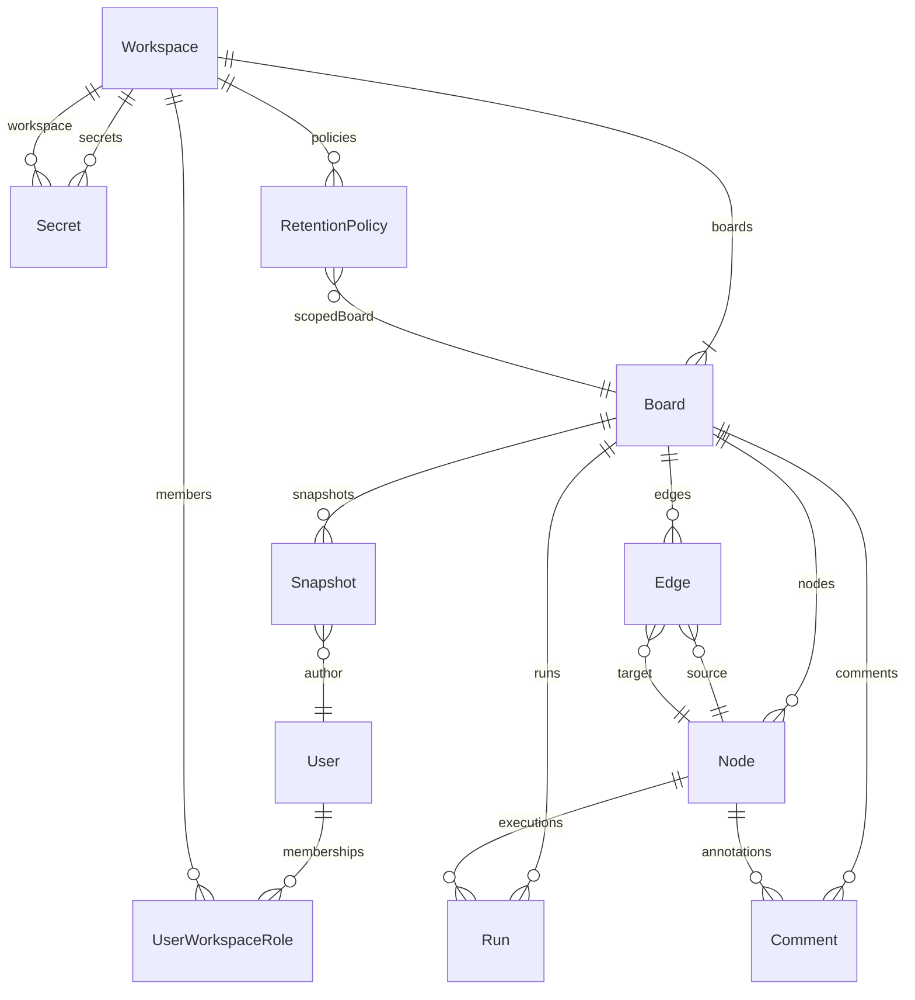

# Workyy ERD (Stage 1)

## Core Entities

- **User** — владелец аккаунта, может принадлежать нескольким рабочим пространствам.
- **Workspace** — пространство сотрудничества; содержит борды, секреты и политики ретенции.
- **Board** — холст с узлами и рёбрами; принадлежит workspace и опционально owner.
- **Node** — элемент DAG (`sql`, `python`, `table`, `plot`), хранит позицию и payload.
- **Edge** — связь зависимости между узлами.
- **Run** — запуск узла, хранит статус, trigger, Arrow результат/ошибку.
- **Snapshot** — сохранённый артефакт борда (Arrow blob + метаданные).
- **Comment** — комментарии к борду/узлам.
- **Secret** — хранилище соединений рабочих пространств.
- **RetentionPolicy** — политика хранения (борды/рун/снапшоты).
- **AuditEvent** — журнал доменных событий (создание бордов, запуск узлов, результаты run).

## Диаграмма

