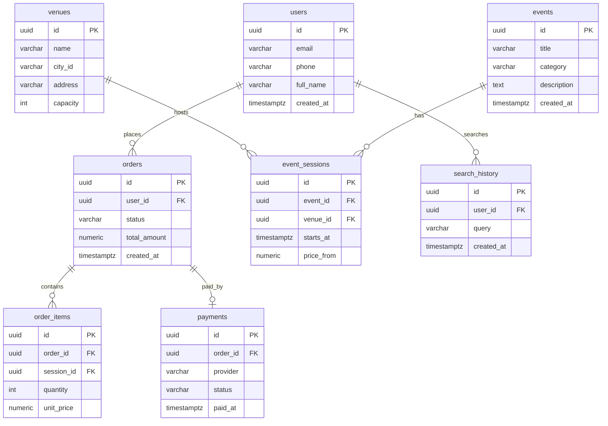

# ПАО «XXX»: требования и проектирование ИС

> Этот Markdown — «перевод» исходного Word-документа в структуру, удобную для работы в репозитории и для генерации задач/кода через Cursor.  
> В местах, где в исходнике были примеры-шаблоны или есть несостыковки с доменом «поиск/покупка билетов», я оставил **TODO**-метки (их Cursor сможет легко подхватить).

## Как использовать в репозитории (рекомендация)

- Положите этот файл в `docs/requirements.md`.
- Разбейте реализацию на Epic’и по разделам **FR / NFR / API / Data model**.
- В Cursor удобно давать запросы вида:
  - “Implement FR1 (fuzzy search) using docs/requirements.md as source of truth”
  - “Generate OpenAPI from section 7 and scaffold handlers + tests”
  - “Create DB schema (PostgreSQL) from section 8 and migrations”

---

## 1. Сфера деятельности ПАО «XXX»

Критерии успешного задания:

- Предоставлен структурированный протокол интервью, который включает: список участников, дату, ключевые вопросы и ответы, а также раздел с выявленными требованиями и договоренностями.
- Представлен аналитический обзор компании, составленный на основе минимум двух источников. Обзор отражает ее основные бизнес-процессы, рынок и позицию.
- Выявлено минимум 3 ограничения на основании регуляторных документов. Для каждого ограничения указан конкретный нормативный акт и пункт/статья, а также кратко описано его влияние на проект.
- Выявлены ключевые стейкхолдеры проекта (минимум 4). Для каждого определена их роль, интерес к проекту и степень влияния. Приведен релевантный фрагмент организационной структуры.
- Описан процесс сбора и анализа информации для разделов 2.1 – 2.3. Для каждого этапа обоснован выбор методов анализа (минимум 3 различных метода).
  Что требуется:
  Привести пример протокола интервью в отдельном приложении.
  Пример:
  Что требуется:
  В разделе приводится краткий аналитический обзор, составленный на основании анализа открытых источников (официальный сайт, бизнес-реестры, СМИ, агрегаторы отзывов).
  Пример:
  ПАО «XXX» – одна из крупнейших в России и Европе телекоммуникационных компаний национального масштаба. По данным компании, её услугами пользуются более 100 млн жителей России.
  Компания занимает лидирующее положение на российском рынке услуг ШПД и платного телевидения: количество абонентов услуг ШПД превышает 12,7 млн, а платного ТВ «XXXа» - более 9,8 млн пользователей».
  «XXX» является безусловным лидером рынка телекоммуникационных услуг для российских органов государственной власти и корпоративных пользователей всех уровней. Выступает исполнителем мероприятий различных государственных программ в области : создание и развитие инфраструктуры (включая ), телекоммуникационное обеспечение (функционирование , организация ), устранение , оснащение широкополосным доступом в сеть интернет лечебных учреждений и другие мероприятия. Обладает крупнейшей в стране общей протяженностью около 500 тысяч км.
  Предоставляет услуги (первое место в России по количеству абонентов), , , и телефонной связи и др. Широкополосный доступ в Интернет.
  Компания предоставляет по технологиям , , , а также по технологии . Компания занимает лидирующее положение на российском рынке услуг ШПД: количество абонентов этих услуг превышает 11,9 млн.
  Компания предоставляет услуги интерактивного телевидения в стандарте . Компания занимает лидирующее положение на российском рынке услуг платного телевидения: количество абонентов платного ТВ «XXXа» — более 8,8 млн пользователей.
  Компания также предоставляет услуги местной телефонной связи, междугородной и международной телефонной связи, сотовой связи.
  Источники: официальный сайт, ЕГРЮЛ, отраслевые СМИ, агрегаторы отзывов.
  Что требуется:
  В разделе перечисляются ключевые законодательные и нормативные ограничения, влияющие на проект.
  Пример:
  Закон №152-ФЗ «О персональных данных»: требования к хранению, обработке и защите ПДн.
  Закон №149-ФЗ «Об информации…»: ограничения на распространение и обработку информации.
  Отраслевые стандарты безопасности, лицензирование отдельных видов деятельности.
  Что требуется:
  Привести перечень ключевых стейкхолдеров проекта и фрагмент оргструктуры.
  | Роль/Должность | Описание вклада и интересов в проекте |
  | --- | --- |
  | Генеральный директор (Босс, CEO) | Определяет стратегические цели проекта, принимает ключевые решения, утверждает бюджет и сроки. Является высшим руководителем, которому подчиняются все остальные топ-менеджеры. |
  | Заместитель генерального директора по ИТ (CIO/ИТ-директор) | Отвечает за реализацию ИТ-стратегии, внедрение и эксплуатацию информационных систем, координирует работу технических подразделений, контролирует кибербезопасность и ИТ-инфраструктуру. |
  | Директор по развитию (Второй заместитель босса) | Формирует стратегию роста, анализирует рынок и конкурентов, отвечает за запуск новых проектов и оптимизацию бизнес-процессов, контролирует выполнение плановых показателей развития. |
  | Руководители подразделений (ИТ, бизнес, поддержка, эксплуатация) | Обеспечивают внедрение и эксплуатацию системы в своих департаментах, отвечают за выполнение задач в рамках своих направлений, взаимодействуют с проектной командой, предоставляют требования и обратную связь. |
  | Проектная команда (менеджер проекта, аналитики, разработчики, тестировщики) | Реализует проектные задачи, разрабатывает и внедряет решения, обеспечивает техническую и бизнес-экспертизу, взаимодействует с пользователями и руководством. |
  | Пользователи системы | Конечные пользователи, предоставляют обратную связь о функциональности и удобстве системы, участвуют в тестировании и обучении. |
  | Заказчик/финансирующая сторона | Определяет цели, бюджет и рамки проекта, контролирует ход реализации и принимает результаты. |
  | Внешние подрядчики и партнёры | Поставляют технологии, оборудование, услуги, могут быть привлечены для интеграции, поддержки или консалтинга. |
  Что требуется:
  Необходимо описать, как проводился анализ для подготовки разделов 2.1 и 2.2:
  Анализ открытых источников (официальные сайты, СМИ, реестры)
  Интервью с ключевыми стейкхолдерами
  Анализ внутренних документов компании
  Сравнительный анализ с аналогичными решениями на рынке
  В приложениях размещаются скриншоты, выдержки, ссылки на использованные источники.
  Варианты анализа для выбора:
  Интервью: персональные или групповые беседы с заказчиками, пользователями или экспертами для выявления ожиданий, проблем и ограничений.
  Опросы и анкетирование: использование структурированных или открытых опросников для сбора информации от широкой аудитории.
  Воркшопы и мозговые штурмы: совместные сессии с участием различных стейкхолдеров для генерации идей, обсуждения и согласования требований.
  Наблюдение (Job Shadowing): анализ реальной работы пользователей с системой или процессом для выявления скрытых требований и проблем.
  Анализ документации: изучение существующих документов, инструкций, нормативных актов, спецификаций и стандартов.
  Анализ бизнес-процессов: моделирование и анализ текущих процессов с помощью BPMN, блок-схем, диаграмм потоков данных, IDEF и др..
  User Story Mapping: визуализация пользовательских историй для выявления пробелов и зависимостей в требованиях.
  Прототипирование: создание макетов, прототипов интерфейса или MVP для проверки и уточнения требований.
  Анализ системных интерфейсов и API: изучение взаимодействия с другими системами, анализ интеграционных требований.
  Анализ пользовательского интерфейса (UI/UX Benchmarking): сравнение с отраслевыми стандартами и лучшими практиками по интерфейсам.
  Сравнительный анализ (Benchmarking): сравнение требований с аналогичными решениями на рынке или внутри компании.
  Структурный анализ: декомпозиция сложных требований на более простые и понятные элементы.
  Метод Kano: классификация требований по степени влияния на удовлетворённость пользователя (обязательные, желательные, дополнительные).
  Метод MoSCoW: приоритизация требований по категориям: Must have, Should have, Could have, Won’t have.
  Диаграммы UML: использование вариантов использования, диаграмм классов, последовательностей и др. для формализации требований.
  Диаграммы ролевой деятельности (RAD), цветные сети Петри, IDEF: для сложных процессов и систем.
  Работа в «поле» (Field Study): погружение в рабочую среду пользователя для глубокого понимания контекста.
  Фокус-группы: обсуждение требований с группой пользователей или экспертов для выявления мнений и предпочтений.
  Повторное использование требований: применение стандартных или типовых требований из других проектов.
  Вовлечение представителя заказчика в команду: постоянное участие ключевого стейкхолдера в проектной команде для оперативного уточнения требований.
  Демонстрация и презентации: проведение демо-сессий, презентаций макетов и прототипов для уточнения и согласования требований.

---

## 2. Протокол интервью с заказчиком

Что требуется:
Привести пример протокола интервью в отдельном приложении.
Пример:

**TODO (заполнить):**

- Дата/время интервью
- Участники (ФИО, роль)
- Вопросы/ответы
- Выявленные требования
- Договорённости (кто/что/когда)

---

## 3. Обзорная информация о компании

Что требуется:
В разделе приводится краткий аналитический обзор, составленный на основании анализа открытых источников (официальный сайт, бизнес-реестры, СМИ, агрегаторы отзывов).
Пример:
ПАО «XXX» – одна из крупнейших в России и Европе телекоммуникационных компаний национального масштаба. По данным компании, её услугами пользуются более 100 млн жителей России.
Компания занимает лидирующее положение на российском рынке услуг ШПД и платного телевидения: количество абонентов услуг ШПД превышает 12,7 млн, а платного ТВ «XXXа» - более 9,8 млн пользователей».
«XXX» является безусловным лидером рынка телекоммуникационных услуг для российских органов государственной власти и корпоративных пользователей всех уровней. Выступает исполнителем мероприятий различных государственных программ в области : создание и развитие инфраструктуры (включая ), телекоммуникационное обеспечение (функционирование , организация ), устранение , оснащение широкополосным доступом в сеть интернет лечебных учреждений и другие мероприятия. Обладает крупнейшей в стране общей протяженностью около 500 тысяч км.
Предоставляет услуги (первое место в России по количеству абонентов), , , и телефонной связи и др. Широкополосный доступ в Интернет.
Компания предоставляет по технологиям , , , а также по технологии . Компания занимает лидирующее положение на российском рынке услуг ШПД: количество абонентов этих услуг превышает 11,9 млн.
Компания предоставляет услуги интерактивного телевидения в стандарте . Компания занимает лидирующее положение на российском рынке услуг платного телевидения: количество абонентов платного ТВ «XXXа» — более 8,8 млн пользователей.
Компания также предоставляет услуги местной телефонной связи, междугородной и международной телефонной связи, сотовой связи.
Источники: официальный сайт, ЕГРЮЛ, отраслевые СМИ, агрегаторы отзывов.

**TODO:** приложить ссылки/скриншоты/выдержки источников (сайт, реестры, СМИ, отзывы).

---

## 4. Регуляторные ограничения

Что требуется:
В разделе перечисляются ключевые законодательные и нормативные ограничения, влияющие на проект.
Пример:
Закон №152-ФЗ «О персональных данных»: требования к хранению, обработке и защите ПДн.
Закон №149-ФЗ «Об информации…»: ограничения на распространение и обработку информации.
Отраслевые стандарты безопасности, лицензирование отдельных видов деятельности.

**TODO (минимум 3 ограничения):**

- Указать **нормативный акт + статью/пункт** + влияние на проект (данные, логирование, хранение, безопасность и т.д.)

---

## 5. Стейкхолдеры и оргструктура

Что требуется:
Привести перечень ключевых стейкхолдеров проекта и фрагмент оргструктуры.
| Роль/Должность | Описание вклада и интересов в проекте |
| --- | --- |
| Генеральный директор (Босс, CEO) | Определяет стратегические цели проекта, принимает ключевые решения, утверждает бюджет и сроки. Является высшим руководителем, которому подчиняются все остальные топ-менеджеры. |
| Заместитель генерального директора по ИТ (CIO/ИТ-директор) | Отвечает за реализацию ИТ-стратегии, внедрение и эксплуатацию информационных систем, координирует работу технических подразделений, контролирует кибербезопасность и ИТ-инфраструктуру. |
| Директор по развитию (Второй заместитель босса) | Формирует стратегию роста, анализирует рынок и конкурентов, отвечает за запуск новых проектов и оптимизацию бизнес-процессов, контролирует выполнение плановых показателей развития. |
| Руководители подразделений (ИТ, бизнес, поддержка, эксплуатация) | Обеспечивают внедрение и эксплуатацию системы в своих департаментах, отвечают за выполнение задач в рамках своих направлений, взаимодействуют с проектной командой, предоставляют требования и обратную связь. |
| Проектная команда (менеджер проекта, аналитики, разработчики, тестировщики) | Реализует проектные задачи, разрабатывает и внедряет решения, обеспечивает техническую и бизнес-экспертизу, взаимодействует с пользователями и руководством. |
| Пользователи системы | Конечные пользователи, предоставляют обратную связь о функциональности и удобстве системы, участвуют в тестировании и обучении. |
| Заказчик/финансирующая сторона | Определяет цели, бюджет и рамки проекта, контролирует ход реализации и принимает результаты. |
| Внешние подрядчики и партнёры | Поставляют технологии, оборудование, услуги, могут быть привлечены для интеграции, поддержки или консалтинга. |

### 5.1. Таблица стейкхолдеров (из исходника)

| Роль/Должность                                                              | Описание вклада и интересов в проекте                                                                                                                                                                          |
| --------------------------------------------------------------------------- | -------------------------------------------------------------------------------------------------------------------------------------------------------------------------------------------------------------- |
| Генеральный директор (Босс, CEO)                                            | Определяет стратегические цели проекта, принимает ключевые решения, утверждает бюджет и сроки. Является высшим руководителем, которому подчиняются все остальные топ-менеджеры.                                |
| Заместитель генерального директора по ИТ (CIO/ИТ-директор)                  | Отвечает за реализацию ИТ-стратегии, внедрение и эксплуатацию информационных систем, координирует работу технических подразделений, контролирует кибербезопасность и ИТ-инфраструктуру.                        |
| Директор по развитию (Второй заместитель босса)                             | Формирует стратегию роста, анализирует рынок и конкурентов, отвечает за запуск новых проектов и оптимизацию бизнес-процессов, контролирует выполнение плановых показателей развития.                           |
| Руководители подразделений (ИТ, бизнес, поддержка, эксплуатация)            | Обеспечивают внедрение и эксплуатацию системы в своих департаментах, отвечают за выполнение задач в рамках своих направлений, взаимодействуют с проектной командой, предоставляют требования и обратную связь. |
| Проектная команда (менеджер проекта, аналитики, разработчики, тестировщики) | Реализует проектные задачи, разрабатывает и внедряет решения, обеспечивает техническую и бизнес-экспертизу, взаимодействует с пользователями и руководством.                                                   |
| Пользователи системы                                                        | Конечные пользователи, предоставляют обратную связь о функциональности и удобстве системы, участвуют в тестировании и обучении.                                                                                |
| Заказчик/финансирующая сторона                                              | Определяет цели, бюджет и рамки проекта, контролирует ход реализации и принимает результаты.                                                                                                                   |
| Внешние подрядчики и партнёры                                               | Поставляют технологии, оборудование, услуги, могут быть привлечены для интеграции, поддержки или консалтинга.                                                                                                  |

**TODO:** добавить степень влияния/интереса (например, High/Medium/Low) и схему оргструктуры (картинкой в репо или Mermaid/PlantUML).

---

## 6. Описание методов анализа

Что требуется:
Необходимо описать, как проводился анализ для подготовки разделов 2.1 и 2.2:
Анализ открытых источников (официальные сайты, СМИ, реестры)
Интервью с ключевыми стейкхолдерами
Анализ внутренних документов компании
Сравнительный анализ с аналогичными решениями на рынке
В приложениях размещаются скриншоты, выдержки, ссылки на использованные источники.
Варианты анализа для выбора:
Интервью: персональные или групповые беседы с заказчиками, пользователями или экспертами для выявления ожиданий, проблем и ограничений.
Опросы и анкетирование: использование структурированных или открытых опросников для сбора информации от широкой аудитории.
Воркшопы и мозговые штурмы: совместные сессии с участием различных стейкхолдеров для генерации идей, обсуждения и согласования требований.
Наблюдение (Job Shadowing): анализ реальной работы пользователей с системой или процессом для выявления скрытых требований и проблем.
Анализ документации: изучение существующих документов, инструкций, нормативных актов, спецификаций и стандартов.
Анализ бизнес-процессов: моделирование и анализ текущих процессов с помощью BPMN, блок-схем, диаграмм потоков данных, IDEF и др..
User Story Mapping: визуализация пользовательских историй для выявления пробелов и зависимостей в требованиях.
Прототипирование: создание макетов, прототипов интерфейса или MVP для проверки и уточнения требований.
Анализ системных интерфейсов и API: изучение взаимодействия с другими системами, анализ интеграционных требований.
Анализ пользовательского интерфейса (UI/UX Benchmarking): сравнение с отраслевыми стандартами и лучшими практиками по интерфейсам.
Сравнительный анализ (Benchmarking): сравнение требований с аналогичными решениями на рынке или внутри компании.
Структурный анализ: декомпозиция сложных требований на более простые и понятные элементы.
Метод Kano: классификация требований по степени влияния на удовлетворённость пользователя (обязательные, желательные, дополнительные).
Метод MoSCoW: приоритизация требований по категориям: Must have, Should have, Could have, Won’t have.
Диаграммы UML: использование вариантов использования, диаграмм классов, последовательностей и др. для формализации требований.
Диаграммы ролевой деятельности (RAD), цветные сети Петри, IDEF: для сложных процессов и систем.
Работа в «поле» (Field Study): погружение в рабочую среду пользователя для глубокого понимания контекста.
Фокус-группы: обсуждение требований с группой пользователей или экспертов для выявления мнений и предпочтений.
Повторное использование требований: применение стандартных или типовых требований из других проектов.
Вовлечение представителя заказчика в команду: постоянное участие ключевого стейкхолдера в проектной команде для оперативного уточнения требований.
Демонстрация и презентации: проведение демо-сессий, презентаций макетов и прототипов для уточнения и согласования требований.

---

## 7. Основные проблемы и пути решения

Критерии успешного задания:
Сформулировано минимум две различные проблемы. Формулировка проблемы должна отвечать на вопросы «Что? Где? Почему это проблема?»
Предложено минимум одно решение выявленной проблемы
Для каждого предложенного решения определены минимум 2 измеримые цели, сформулированные по принципу SMART
Пример:
Одной из текущих проблем является отсутствие системы самообслуживания для клиентов корпоративного и государственного сегмента. Система самообслуживания разработана только для сегмента B2C. В сегменте В2В и B2G взаимодействие Клиента осуществляется только через персонального менеджера.
Для автоматизации процессов самообслуживания клиентов ПАО «XXX» корпоративного и государственного сегментов было рассмотрено внедрение система «Личный кабинет для клиентов корпоративного и государственного сегмента».
Преследуемые цели:
улучшения клиентского опыта корпоративных клиентов от продуктов и сервисов ПАО «XXX»;
сокращение оттока клиентов за счет повышения качества и удобства обслуживания;
сокращения затрат компании за счет перехода на дистанционные каналы обслуживания;
Разработанная система (ЛК B2B) позволит создать дополнительный канал приема и регистрации обращений на подключение услуг. ЛК можно будет использовать для получения информации о статусе выполнения текущих заявок.
Для Клиентов система ЛК B2B предоставит функционал по получению финансовой информации о подключенных услугах, детализаций по текущим расходам и доходам, текущим договорам и задолженностям в инструменте самообслуживания; даст инструментарий для быстрого анализа стоимости и объемов подключенных услуг;
С точки зрения улучшения качества обслуживания ЛК B2B даст возможность проводить быстрое оповещение Клиентов о возможных проблемах с сервисами и услугами ПАО "XXX", а также о проведении плановых и аварийных работ.

**TODO (для текущего проекта):**

- Сформулировать минимум **2 проблемы** в формате “Что? Где? Почему это проблема?”
- Для каждой — минимум **1 решение**
- Для каждого решения — минимум **2 SMART-цели** (метрика, целевое значение, срок)

---

## 8. Модель жизненного цикла

Критерии успешного задания:
Сформулированы ответы на поставленные вопросы.
Заполнены таблицы в пунктах 4.2, 4.3.
Выбор методологии обоснован минимум двумя аргументами, исходя из специфики проекта.
Приложена корректная и читаемая диаграмма, наглядно иллюстрирующая выбранную модель ЖЦ ПО.
Приложен читаемый скриншот созданной структурированной канбан-доски (есть колонки, например, «Бэклог», «В работе», «Тестирование», «Готово»). Доска заполнена релевантными тестовыми задачами.
Что такое жизненный цикл ПО? Какой выбрали для вашего проекта? Приложите диаграмму.
Жизненный цикл ПО – это…
| Этап | Описание | Результаты |
| --- | --- | --- |
| Инициация | | |
| Планирование | | |
| | | |
| Тестирование | | |
| Релиз | | |
| Сопровождение | | |
| Критерий | | Waterfall |
| --- | --- | --- |
| Гибкость | | |
| | | |
| | | |
| Риски | | |
| | | |
Для эффективного управления задачами в рамках гибкой методологии (Agile/Scrum) выбран инструмент Yougile.
Примечание: приложить скриншот разработанной Kanban доски
Почему сделан выбор в пользу этой методологии?

### 8.1. Этапы жизненного цикла в Agile (Scrum)

| Этап          | Описание | Результаты |
| ------------- | -------- | ---------- |
| Инициация     |          |            |
| Планирование  |          |            |
|               |          |            |
| Тестирование  |          |            |
| Релиз         |          |            |
| Сопровождение |          |            |

### 8.2. Сравнение методологии с другими (шаблон)

| Критерий |     | Waterfall |
| -------- | --- | --------- |
| Гибкость |     |           |
|          |     |           |
|          |     |           |
| Риски    |     |           |
|          |     |           |

### 8.3. Инструменты управления

Для эффективного управления задачами в рамках гибкой методологии (Agile/Scrum) выбран инструмент Yougile.
Примечание: приложить скриншот разработанной Kanban доски

**TODO:** приложить скриншот Kanban-доски (Yougile/аналог) и заполнить релевантными задачами.

---

## 9. Функциональные требования (FR)

Критерии успешного задания:
Сформулировано минимум 3 функциональных требования, каждое из которых описывает конкретную функцию или возможность системы.
Каждое требование должно быть написано в формате пользовательской истории или четко описывать что система должна делать.
Требования должны быть измеримыми и проверяемыми - должно быть понятно, как можно будет проверить их выполнение.
Функциональные требования должны соответствовать выявленным проблемам из раздела 3 и потребностям стейкхолдеров из раздела 2.4.
Каждое требование должно иметь уникальный идентификатор (например, FR1, FR2, FR3) для возможности ссылок на него в других разделах документа.
Пользователь заходит на платформу и начинает поиск интересующего мероприятия. На этом этапе нечеткий поиск активируется при вводе в поисковую строку:
Название мероприятия с опечатками: "Лебединое озира" → находит "Лебединое озеро"
Неточное написание исполнителя: "Грегори Лепс" → находит "Григорий Лепс"
Сохранение истории последних 20 поисковых запросов пользователя
Популярные запросы в текущем регионе/городе (топ-5)
Персонализированные рекомендации на основе:
Предыдущих покупок билетов
Просмотренных мероприятий
Выбранных категорий интересов
Быстрый доступ к часто используемым запросам через иконки
Распознавание контекста запроса:
"Большой театр завтра" → поиск мероприятий в Большом театре на завтра
"Концерт рок 2025" → поиск рок-концертов в 2025 году
"Детские спектакли выходные" → поиск детских спектаклей на выходные
Обработка дат в естественном языке:
"на завтра", "в эту субботу", "на новый год"
"15 марта", "март 2025", "весной"
Учет локации пользователя для релевантности результатов (если разрешено)

### FR1 — Нечёткий поиск

Пользователь заходит на платформу и начинает поиск интересующего мероприятия. На этом этапе нечеткий поиск активируется при вводе в поисковую строку:
Название мероприятия с опечатками: "Лебединое озира" → находит "Лебединое озеро"
Неточное написание исполнителя: "Грегори Лепс" → находит "Григорий Лепс"

**Проверяемость (рекомендуемые acceptance criteria):**

- При вводе запроса с 1–2 опечатками система возвращает релевантные результаты.
- Для примеров из требования результаты включают корректный объект в топ-N (например, топ-5).

### FR2 — История и персонализация

Сохранение истории последних 20 поисковых запросов пользователя
Популярные запросы в текущем регионе/городе (топ-5)
Персонализированные рекомендации на основе:
Предыдущих покупок билетов
Просмотренных мероприятий
Выбранных категорий интересов
Быстрый доступ к часто используемым запросам через иконки

**Проверяемость (рекомендуемые acceptance criteria):**

- История хранит последние **20** запросов (по времени убывания).
- Показывается **топ-5** популярных запросов по городу/региону.
- Рекомендации формируются из (покупки/просмотры/интересы), логика задокументирована.

### FR3 — Интеллектуальные возможности

Распознавание контекста запроса:
"Большой театр завтра" → поиск мероприятий в Большом театре на завтра
"Концерт рок 2025" → поиск рок-концертов в 2025 году
"Детские спектакли выходные" → поиск детских спектаклей на выходные
Обработка дат в естественном языке:
"на завтра", "в эту субботу", "на новый год"
"15 марта", "март 2025", "весной"
Учет локации пользователя для релевантности результатов (если разрешено)

**Проверяемость (рекомендуемые acceptance criteria):**

- Поддержка распознавания естественных дат (“завтра”, “в эту субботу”, “15 марта”, “весной”).
- Контекстные запросы (“Большой театр завтра”) корректно преобразуются в фильтры (venue + date).

---

## 10. Нефункциональные требования (NFR / FURPS+)

Критерии успешного задания:
Представлены все 4 категории FURPS+:
Usability (Удобство использования)
Reliability (Надежность)
Performance (Производительность)
Supportability (Поддерживаемость)
В каждой категории сформулировано минимум 3 требования с уникальными идентификаторами (например, US1, RL1, PF1, SP1, SC1).
Каждое нефункциональное требование должно быть количественно измеримым там, где это возможно (время отклика, процент доступности, количество пользователей и т.д.).
Требования должны быть реалистичными и достижимыми в рамках заявленного проекта и бюджета.
Нефункциональные требования должны поддерживать достижение целей, сформулированных в разделе 3 (основные проблемы и пути решения).
Для требований безопасности обязательно указание на соответствие регуляторным ограничениям из раздела 2.3.
Платформа обеспечивает круглосуточное обслуживание пользователей для бронирования и покупки билетов без плановых технических перерывов, включая периоды пиковых нагрузок во время анонсов популярных мероприятий.
При возникновении критических сбоев, влияющих на доступность ключевых функций (поиск, бронирование, оплата), платформа должна быть полностью восстановлена в течение максимум 4 часов с момента обнаружения проблемы.
Платформа обеспечивает коэффициент готовности не менее 99% в течение календарного года, что соответствует допустимому времени недоступности не более 87,6 часов в год при учете всех плановых и внеплановых простоев.
Вся коммуникация между пользовательскими устройствами и серверами платформы осуществляется исключительно через шифрованный канал HTTPS с поддержкой TLS 1.3, обеспечивая конфиденциальность передачи билетной информации, платежных реквизитов и персональных данных клиентов.
Система предоставляет пользователям возможность входа через комбинацию логина/пароля с обязательной активацией двухфакторной аутентификации для операций, связанных с финансовыми транзакциями и изменением личных данных, поддерживая SMS-коды, authenticator-приложения и биометрическую верификацию.
Административный интерфейс реализует ролевую модель доступа с четким разграничением полномочий: операторы колл-центра имеют доступ только к функциям поддержки клиентов, менеджеры мероприятий управляют контентом и ценами, системные администраторы контролируют техническую конфигурацию, при этом критические операции требуют подтверждения от двух администраторов.
Система автоматически отслеживает ключевые показатели производительности и отправляет предупреждения администраторам при приближении к критическим значениям нагрузки, создавая детализированные отчеты о сбоях для ускорения процесса устранения неполадок.
Новые сотрудники службы поддержки проходят обязательную программу обучения работе с платформой, включающую практические сессии по обработке типовых запросов клиентов и регулярное повышение квалификации при выходе новых версий системы.
Все элементы пользовательского интерфейса (результаты поиска мероприятий, схема зала, страница оформления заказа) должны отображаться не более чем за 2 секунды при стандартной нагрузке до 5000 одновременных пользователей, включая время загрузки изображений афиш и интерактивных карт залов с детализацией до отдельных мест.
Платформа обеспечивает стабильную работу при одновременном обслуживании не менее 10 000 активных пользователей без деградации основных функций бронирования и оплаты, автоматически масштабируясь до 25 000 пользователей во время анонсов билетов на топовые мероприятия (концерты звезд, премьеры спектаклей).
Пользовательский интерфейс платформы обеспечивает единообразный опыт взаимодействия на десктопных компьютерах, планшетах и смартфонах с автоматической адаптацией элементов управления под размер экрана, поддерживая корректное отображение в браузерах Chrome, Safari, Firefox и Edge, при этом ключевые действия (поиск, выбор мест, оплата) доступны максимум в 3 клика от главной страницы.
Вся текстовая информация платформы представлена на литературном русском языке без использования жаргонизмов: описания мероприятий, условия покупки и возврата, уведомления об ошибках, справочные материалы, при этом архитектура системы позволяет добавление дополнительных языковых пакетов для расширения на международные рынки без изменения базового функционала.

> ⚠️ В исходнике некоторые категории содержат меньше 3 требований (например, Supportability/Usability/Performance).  
> Добавьте недостающие требования как **TODO**, чтобы соблюсти критерии задания.

### Reliability (Надёжность)

#### RL1

Платформа обеспечивает круглосуточное обслуживание пользователей для бронирования и покупки билетов без плановых технических перерывов, включая периоды пиковых нагрузок во время анонсов популярных мероприятий.

#### RL2

При возникновении критических сбоев, влияющих на доступность ключевых функций (поиск, бронирование, оплата), платформа должна быть полностью восстановлена в течение максимум 4 часов с момента обнаружения проблемы.

#### RL3

Платформа обеспечивает коэффициент готовности не менее 99% в течение календарного года, что соответствует допустимому времени недоступности не более 87,6 часов в год при учете всех плановых и внеплановых простоев.

### Security (Безопасность)

#### SC1

Вся коммуникация между пользовательскими устройствами и серверами платформы осуществляется исключительно через шифрованный канал HTTPS с поддержкой TLS 1.3, обеспечивая конфиденциальность передачи билетной информации, платежных реквизитов и персональных данных клиентов.

#### SC2

Система предоставляет пользователям возможность входа через комбинацию логина/пароля с обязательной активацией двухфакторной аутентификации для операций, связанных с финансовыми транзакциями и изменением личных данных, поддерживая SMS-коды, authenticator-приложения и биометрическую верификацию.

#### SC3

Административный интерфейс реализует ролевую модель доступа с четким разграничением полномочий: операторы колл-центра имеют доступ только к функциям поддержки клиентов, менеджеры мероприятий управляют контентом и ценами, системные администраторы контролируют техническую конфигурацию, при этом критические операции требуют подтверждения от двух администраторов.

### Supportability (Поддерживаемость)

#### SP4

Система автоматически отслеживает ключевые показатели производительности и отправляет предупреждения администраторам при приближении к критическим значениям нагрузки, создавая детализированные отчеты о сбоях для ускорения процесса устранения неполадок.

#### SP5

Новые сотрудники службы поддержки проходят обязательную программу обучения работе с платформой, включающую практические сессии по обработке типовых запросов клиентов и регулярное повышение квалификации при выходе новых версий системы.

**TODO:** добавить минимум 1 требование (например, SP6: документация/Runbook, SP7: SLA поддержки).

### Performance (Производительность)

#### PF1

Все элементы пользовательского интерфейса (результаты поиска мероприятий, схема зала, страница оформления заказа) должны отображаться не более чем за 2 секунды при стандартной нагрузке до 5000 одновременных пользователей, включая время загрузки изображений афиш и интерактивных карт залов с детализацией до отдельных мест.

#### PF2

Платформа обеспечивает стабильную работу при одновременном обслуживании не менее 10 000 активных пользователей без деградации основных функций бронирования и оплаты, автоматически масштабируясь до 25 000 пользователей во время анонсов билетов на топовые мероприятия (концерты звезд, премьеры спектаклей).

**TODO:** добавить минимум 1 требование (например, PF3: p95 latency API поиска).

### Usability (Удобство использования)

#### US1

Пользовательский интерфейс платформы обеспечивает единообразный опыт взаимодействия на десктопных компьютерах, планшетах и смартфонах с автоматической адаптацией элементов управления под размер экрана, поддерживая корректное отображение в браузерах Chrome, Safari, Firefox и Edge, при этом ключевые действия (поиск, выбор мест, оплата) доступны максимум в 3 клика от главной страницы.

#### US2

Вся текстовая информация платформы представлена на литературном русском языке без использования жаргонизмов: описания мероприятий, условия покупки и возврата, уведомления об ошибках, справочные материалы, при этом архитектура системы позволяет добавление дополнительных языковых пакетов для расширения на международные рынки без изменения базового функционала.

**TODO:** добавить минимум 1 требование (например, US3: доступность WCAG/контрастность/клавиатурная навигация).

---

## 11. Проектирование REST-запроса

Критерии успешного задания:

- Обязательно к выполнению:
- 7.1 требование
- 7.3 API
- Суммарное количество параметров входящего и ответного сообщения не должно быть меньше 5
  Укажите требование из раздела 5, в рамках которого будет разрабатываться REST-запрос
  Отметьте элементы интерфейса, которые будут участвовать в формировании входящего сообщения, а также те, которые будут заполнены после получения ответного сообщения
  | UI-элемент | Описание |
  | --- | --- |
  | Название UI- элемента, который приводит к выполнению запроса | Описание особенностей отображения элемента<br>Описание действий при нажатии |
  | Кнопка «Поиск» (11) | При наведении отобразить тултип с текстом «Поиск учеников»<br>При нажатии отправить запрос POST /search |
  | Название атрибута на UI | Тип данных, размерность | Атрибут | Правило заполнения | Источник |
  | --- | --- | --- | --- | --- |
  | Укажите название атрибута и номер | | Укажите атрибуты, участвующие в формировании параметра на UI | Укажите, если применимо:<br>формат вывода <br>особенности правила заполнения, например, что выводить, если значение не пришло; отображать ли заголовок значения и т д | Укажите запрос, из которого получены данные |
  | Фамилия ученика (1) | String (100) | []/child/surname | При отсутствии значения отобразить прочерк | POST /search |
  | UI-элемент | Описание |
  | --- | --- |
  | Перечисление UI элементов (тостов, сообщений и т д), возникающих при получении ответа | Описание условий отображения |
  | Тост «Данные получены» | Отобразить при выполнении условий:<br>Получен http код 200 в ответном сообщении POST /search<br>Массив в ответном сообщении не пустой |
  | Сообщение «Нет данных» | Отобразить при выполнении условий:<br>Получен http код 404 в ответном сообщении POST /search |
  Необходимо заполнить колонку «Описание». Курсивом указаны подсказки к заполнению полей
  | Наименование | Описание |
  | --- | --- |
  | Цель | Опишите цель запроса |
  | Источник | Опишите источник запроса (если запрос выполняется с UI, то писать UI) |
  | Потребитель | Название сервиса / системы, обрабатывающей запрос (придумайте название сервиса / системы) |
  | Механизм обмена | 2-Way (request, response), синхронный, <br>Примечание: в реальных проектах могут быть использованы механизмы обмена (1-Way (request), асинхронный) |
  | Способ взаимодействия | REST API<br>Примечание: в реальных проектах могут быть использованы другие способы взаимодействия (Kafka, RabbitMQ, GraphQL, gRPC, SOAP, WebSocket и т д) |
  | Метод | GET, POST, PUT, DELETE, PATCH и т д |
  | URL | Укажите url запроса |
  | Формат запроса | Укажите тип данных запроса (например, JSON / XML) |
  | Контейнер | Атрибут | Тип данных | Размерность | Обязательность | Описание | Особенности заполнения |
  | --- | --- | --- | --- | --- | --- | --- |
  | Укажите вложенность атрибута<br>Если атрибут лежит в корне объекта, то не заполнять | Укажите название атрибута в контракте | Изучите возможные типы данных для выбранного формата запроса | Укажите размерность | О/Н/УО<br>При выборе УО (условная обязательность) укажите условие, при котором атрибут становится обязательным | Укажите описание | Укажите особенности валидации, примечания при необходимости |
  | | surname | String | 100 | O | Фамилия ученика | |
  | sort | paramName | String | 100 | Н | Название атрибута, по которому ожидается сортировка | Возможные значения: |
  | sort | direction | String | 4 | Н | Направление сортировки | Возможные значения: asc, desc |
  | … | … | … | … | … | … | … |
  Приведите пример запроса в json формате
  {
  "name": "Сергей",
  "surname": "Иванов",
  "nameCourse": "Рисование",
  "nameGroup": "3а",
  "sort": {
  "paramName": "surname",
  "direction": "asc"
  }
  }
  | Результат выполнения запроса | Представление |
  | --- | --- |
  | Успешно | Code 200 + ответное сообщение |
  | Перечисление ошибок с кодами и дополнительными атрибутами<br>Ниже пример (!) | Code 403 / 400 … |
  | Недостаточно прав | Code 403 |
  | Заполнены не все обязательные поля | Code 400<br>“error”: “Заполнены не все обязательные поля” |
  Успешный ответ (HTTP code 200)
  | Контейнер | Атрибут | Тип данных | Размерность | Описание |
  | --- | --- | --- | --- | --- |
  | Укажите вложенность атрибута | Укажите название атрибута в контракте | Изучите возможные типы данных для выбранного формата запроса | Укажите размерность | Укажите описание |
  | []/child/ | surname | string | 100 | Фамилия ученика |
  Неуспешный ответ (HTTP code 400/403/404/…)
  | HTTP code | Контейнер | Атрибут | Тип данных | Размерность | Описание | Правило заполнения |
  | --- | --- | --- | --- | --- | --- | --- |
  | 400 | | error | string | 1000 | Текст сообщения об ошибке | Заполнить строкой «Заполнены не все обязательные поля: {1}», где 1 – перечисление незаполненных обязательных полей |
  Приведите пример ответного сообщения
  [
  {
  "child": {
  "childId": 12345,
  "name": "Сергей",
  "surname": "Иванов",
  "age": 5,
  "birthDt": "2019-02-20"
  },
  "parent": {
  "phoneNumber": "89301655615",
  "name": "Ирина",
  "surname": "Иванова"
  }
  }
  ]
- Выполнить проверки:
- Проверить наличие полномочия, разрешающего просмотр списка учеников.
  При отсутствии полномочия вернуть http code 403 (недостаточно прав)
- Проверить входящее сообщение:
- Если заполнены не все обязательные поля, вернуть ошибку http code 400 и сообщение об ошибке
- Отобрать в таблице child записи, у которых child.surname = surname (из входящего сообщения)
- ….
- Сформировать ответное сообщение согласно маппингу
  Примечания:
  Логика должна иметь следующую структуру:
- Выполнение проверок
- Проверка прав доступа
- Проверка входящего сообщения
- Другие бизнес проверки
- Выполнение сути метода:
- Создание / извлечение / изменение данных
- Выполнение дополнительных действий (запрос данных у смежной системы, отправка уведомления пользователям и т д)
- Формирование ответного сообщения
  Примечания:
- Выберите и укажите формат файла (JSON / YAML)
- Заполните спецификацию по разработанному запросу согласно принятой структуре OpenAPI
- Проверьте и визуализируйте сформированную спецификацию в или в visual studio code (расширение OpenAPI (Swagger) Editor)

### 11.1. UI (шаблон из исходника)

> ⚠️ В исходнике пример про “поиск учеников”. Для проекта про мероприятия замените сущности/поля на “мероприятия/события”.

| UI-элемент                                                   | Описание                                                                                                |
| ------------------------------------------------------------ | ------------------------------------------------------------------------------------------------------- |
| Название UI- элемента, который приводит к выполнению запроса | Описание особенностей отображения элемента<br>Описание действий при нажатии                             |
| Кнопка «Поиск» (11)                                          | При наведении отобразить тултип с текстом «Поиск учеников»<br>При нажатии отправить запрос POST /search |

#### UI: отображение полученных данных

| Название атрибута на UI           | Тип данных, размерность | Атрибут                                                      | Правило заполнения                                                                                                                                                    | Источник                                    |
| --------------------------------- | ----------------------- | ------------------------------------------------------------ | --------------------------------------------------------------------------------------------------------------------------------------------------------------------- | ------------------------------------------- |
| Укажите название атрибута и номер |                         | Укажите атрибуты, участвующие в формировании параметра на UI | Укажите, если применимо:<br>формат вывода <br>особенности правила заполнения, например, что выводить, если значение не пришло; отображать ли заголовок значения и т д | Укажите запрос, из которого получены данные |
| Фамилия ученика (1)               | String (100)            | []/child/surname                                             | При отсутствии значения отобразить прочерк                                                                                                                            | POST /search                                |

#### UI-сообщения

| UI-элемент                                                                            | Описание                                                                                                                              |
| ------------------------------------------------------------------------------------- | ------------------------------------------------------------------------------------------------------------------------------------- |
| Перечисление UI элементов (тостов, сообщений и т д), возникающих при получении ответа | Описание условий отображения                                                                                                          |
| Тост «Данные получены»                                                                | Отобразить при выполнении условий:<br>Получен http код 200 в ответном сообщении POST /search<br>Массив в ответном сообщении не пустой |
| Сообщение «Нет данных»                                                                | Отобразить при выполнении условий:<br>Получен http код 404 в ответном сообщении POST /search                                          |

### 11.2. API (шаблон из исходника)

| Наименование          | Описание                                                                                                                                                  |
| --------------------- | --------------------------------------------------------------------------------------------------------------------------------------------------------- |
| Цель                  | Опишите цель запроса                                                                                                                                      |
| Источник              | Опишите источник запроса (если запрос выполняется с UI, то писать UI)                                                                                     |
| Потребитель           | Название сервиса / системы, обрабатывающей запрос (придумайте название сервиса / системы)                                                                 |
| Механизм обмена       | 2-Way (request, response), синхронный, <br>Примечание: в реальных проектах могут быть использованы механизмы обмена (1-Way (request), асинхронный)        |
| Способ взаимодействия | REST API<br>Примечание: в реальных проектах могут быть использованы другие способы взаимодействия (Kafka, RabbitMQ, GraphQL, gRPC, SOAP, WebSocket и т д) |
| Метод                 | GET, POST, PUT, DELETE, PATCH и т д                                                                                                                       |
| URL                   | Укажите url запроса                                                                                                                                       |
| Формат запроса        | Укажите тип данных запроса (например, JSON / XML)                                                                                                         |

#### Входящее сообщение (шаблон)

| Контейнер                                                                           | Атрибут                               | Тип данных                                                   | Размерность         | Обязательность                                                                                                 | Описание                                            | Особенности заполнения                                      |
| ----------------------------------------------------------------------------------- | ------------------------------------- | ------------------------------------------------------------ | ------------------- | -------------------------------------------------------------------------------------------------------------- | --------------------------------------------------- | ----------------------------------------------------------- |
| Укажите вложенность атрибута<br>Если атрибут лежит в корне объекта, то не заполнять | Укажите название атрибута в контракте | Изучите возможные типы данных для выбранного формата запроса | Укажите размерность | О/Н/УО<br>При выборе УО (условная обязательность) укажите условие, при котором атрибут становится обязательным | Укажите описание                                    | Укажите особенности валидации, примечания при необходимости |
|                                                                                     | surname                               | String                                                       | 100                 | O                                                                                                              | Фамилия ученика                                     |                                                             |
| sort                                                                                | paramName                             | String                                                       | 100                 | Н                                                                                                              | Название атрибута, по которому ожидается сортировка | Возможные значения:                                         |
| sort                                                                                | direction                             | String                                                       | 4                   | Н                                                                                                              | Направление сортировки                              | Возможные значения: asc, desc                               |
| …                                                                                   | …                                     | …                                                            | …                   | …                                                                                                              | …                                                   | …                                                           |

#### Выходные данные (шаблон)

| Результат выполнения запроса                                                 | Представление                                             |
| ---------------------------------------------------------------------------- | --------------------------------------------------------- |
| Успешно                                                                      | Code 200 + ответное сообщение                             |
| Перечисление ошибок с кодами и дополнительными атрибутами<br>Ниже пример (!) | Code 403 / 400 …                                          |
| Недостаточно прав                                                            | Code 403                                                  |
| Заполнены не все обязательные поля                                           | Code 400<br>“error”: “Заполнены не все обязательные поля” |

#### Успешный ответ (HTTP 200) — шаблон

| Контейнер                    | Атрибут                               | Тип данных                                                   | Размерность         | Описание         |
| ---------------------------- | ------------------------------------- | ------------------------------------------------------------ | ------------------- | ---------------- |
| Укажите вложенность атрибута | Укажите название атрибута в контракте | Изучите возможные типы данных для выбранного формата запроса | Укажите размерность | Укажите описание |
| []/child/                    | surname                               | string                                                       | 100                 | Фамилия ученика  |

#### Ошибка (HTTP 400/403/404/…) — шаблон

| HTTP code | Контейнер | Атрибут | Тип данных | Размерность | Описание                  | Правило заполнения                                                                                                 |
| --------- | --------- | ------- | ---------- | ----------- | ------------------------- | ------------------------------------------------------------------------------------------------------------------ |
| 400       |           | error   | string     | 1000        | Текст сообщения об ошибке | Заполнить строкой «Заполнены не все обязательные поля: {1}», где 1 – перечисление незаполненных обязательных полей |

---

## 12. Рекомендуемая спецификация API для домена “поиск мероприятий” (для реализации проекта)

> Это **добавление** сверх исходника: чтобы Cursor мог сразу сгенерировать код/контракты в репо.

### 12.1. Endpoint

- **POST** `/api/v1/events/search`
- Формат: JSON
- 2-way sync request/response

### 12.2. Request (пример, >= 5 параметров)

```json
{
  "query": "Большой театр завтра",
  "cityId": "moscow",
  "dateFrom": "2025-12-11",
  "dateTo": "2025-12-11",
  "categories": ["theatre"],
  "page": 1,
  "pageSize": 20,
  "sort": {
    "paramName": "relevance",
    "direction": "desc"
  },
  "userContext": {
    "userId": "00000000-0000-0000-0000-000000000000",
    "usePersonalization": true
  }
}
```

### 12.3. Response (пример)

```json
{
  "total": 123,
  "page": 1,
  "pageSize": 20,
  "items": [
    {
      "eventId": "e_123",
      "title": "Лебединое озеро",
      "performer": "Большой театр",
      "venue": {
        "venueId": "v_77",
        "name": "Большой театр"
      },
      "startsAt": "2025-12-11T19:00:00+03:00",
      "priceFrom": 1500,
      "currency": "RUB",
      "matchScore": 0.92
    }
  ]
}
```

### 12.4. OpenAPI (YAML, минимальный каркас)

```yaml
openapi: 3.0.3
info:
  title: XXX Ticketing API
  version: 0.1.0
paths:
  /api/v1/events/search:
    post:
      summary: Search events (fuzzy + NLP dates + optional personalization)
      requestBody:
        required: true
        content:
          application/json:
            schema:
              $ref: '#/components/schemas/EventSearchRequest'
      responses:
        '200':
          description: OK
          content:
            application/json:
              schema:
                $ref: '#/components/schemas/EventSearchResponse'
        '400':
          description: Validation error
        '403':
          description: Forbidden
components:
  schemas:
    EventSearchRequest:
      type: object
      required: [query, page, pageSize]
      properties:
        query: { type: string, maxLength: 200 }
        cityId: { type: string }
        dateFrom: { type: string, format: date }
        dateTo: { type: string, format: date }
        categories:
          type: array
          items: { type: string }
        page: { type: integer, minimum: 1 }
        pageSize: { type: integer, minimum: 1, maximum: 100 }
        sort:
          type: object
          properties:
            paramName: { type: string }
            direction: { type: string, enum: [asc, desc] }
        userContext:
          type: object
          properties:
            userId: { type: string, format: uuid }
            usePersonalization: { type: boolean }
    EventSearchResponse:
      type: object
      required: [total, page, pageSize, items]
      properties:
        total: { type: integer, minimum: 0 }
        page: { type: integer, minimum: 1 }
        pageSize: { type: integer, minimum: 1 }
        items:
          type: array
          items:
            type: object
            required: [eventId, title, startsAt]
            properties:
              eventId: { type: string }
              title: { type: string }
              performer: { type: string }
              venue:
                type: object
                properties:
                  venueId: { type: string }
                  name: { type: string }
              startsAt: { type: string, format: date-time }
              priceFrom: { type: number }
              currency: { type: string }
              matchScore: { type: number, minimum: 0, maximum: 1 }
```

---

## 13. Концептуальная модель данных (PostgreSQL)

Критерии успешного задания:

- Минимальное количество сущностей: 5
- Минимальное количество атрибутов в сущности: 4
- У каждой сущности должен быть первичный ключ
- Минимум 3 сущности должны быть связаны между собой
  Правила оформления:
- Определите СУБД
- СУБД: PostgreSQL
- Опишите все необходимые сущности
  | Название сущности | Описание сущности |
  | --- | --- |
  | client | Личные данные клиента |
  | request | Обращения |
- Опишите атрибуты сущностей:
  PK – первичный ключ; FK – внешний ключ
  | client | client | client | client | client |
  | --- | --- | --- | --- | --- |
  | Название атрибута | Тип данных | Обязательность | Ключ | Описание атрибута |
  | id | uuid | Да | PK | Идентификатор клиента |
  | first_name | varchar(100) | Да | | Имя |
  | third_name | varchar(100) | Нет | | Отчество |
  | request | request | request | request | request |
  | --- | --- | --- | --- | --- |
  | Название атрибута | Тип данных | Обязательность | Ключ | Описание атрибута |
  | id | integer | Да | PK | Идентификатор обращения |
  | client_id | varchar(36) | Да | FK<br>client.id | Идентификатор клиента |
  | text | varchar(1000) | Нет | | Обращение клиента |
  | is_urgent_flg | bool | Да | | Флаг срочности заявки |
  | urgency_reason | varchar(1000) | УО<br>Да, если атрибут urgency_flg принимает значение true | | Причина срочности |
- ER-диаграмма
  Примечания:
- Выбирайте тип данных с умом. Ориентируйтесь на типы данных для выбранной вами СУБД
- Например:
- PostgreSQL:
- MySql:
- Указывайте связи для вторичных ключей: на какую сущность, на какой атрибут ссылается
- Например: в таблице request атрибут client_id – вторичный ключ. Он ссылается на сущность client, атрибут id
- Придерживайтесь единого правила в наименовании атрибутов.
- Например: без заглавных букв, разделитель слов – нижнее подчеркивание
- УО – условная обязательность.
- Выполнять ER диаграмму удобно с помощью простых скриптов
  Например:

### 13.1. Сущности (шаблон из исходника)

| Название сущности | Описание сущности     |
| ----------------- | --------------------- |
| client            | Личные данные клиента |
| request           | Обращения             |

### 13.2. Атрибуты (шаблон из исходника)

| client            | client       | client         | client | client                |
| ----------------- | ------------ | -------------- | ------ | --------------------- |
| Название атрибута | Тип данных   | Обязательность | Ключ   | Описание атрибута     |
| id                | uuid         | Да             | PK     | Идентификатор клиента |
| first_name        | varchar(100) | Да             |        | Имя                   |
| third_name        | varchar(100) | Нет            |        | Отчество              |

| request           | request       | request                                                    | request         | request                 |
| ----------------- | ------------- | ---------------------------------------------------------- | --------------- | ----------------------- |
| Название атрибута | Тип данных    | Обязательность                                             | Ключ            | Описание атрибута       |
| id                | integer       | Да                                                         | PK              | Идентификатор обращения |
| client_id         | varchar(36)   | Да                                                         | FK<br>client.id | Идентификатор клиента   |
| text              | varchar(1000) | Нет                                                        |                 | Обращение клиента       |
| is_urgent_flg     | bool          | Да                                                         |                 | Флаг срочности заявки   |
| urgency_reason    | varchar(1000) | УО<br>Да, если атрибут urgency_flg принимает значение true |                 | Причина срочности       |

---

## 14. Рекомендуемая модель данных для платформы билетов (добавление для реализации)

Минимум 5 сущностей, минимум 4 атрибута, PK у каждой, связи минимум между 3 сущностями.

### 14.1. Сущности

- `users` — пользователи/клиенты
- `events` — мероприятия
- `venues` — площадки
- `event_sessions` — конкретные сеансы/даты мероприятия
- `orders` — заказы
- `order_items` — позиции заказа (билеты)
- `payments` — платежи
- `search_history` — история запросов (для FR2)

### 14.2. Связи (кратко)

- `venues (1) -> (N) event_sessions`
- `events (1) -> (N) event_sessions`
- `users (1) -> (N) orders`
- `orders (1) -> (N) order_items`
- `orders (1) -> (0..1) payments`
- `users (1) -> (N) search_history`

### 14.3. Мини-каркас ER в Mermaid (можно хранить в репо)



---

## 15. Диаграммы процессов (BPMN) и UML

Примечания:
Начните с простого: не пытайтесь сразу создать сложную диаграмму. Начните с базовой модели и постепенно добавляйте детали.
Используйте цвета и шрифты осмысленно: Цвета и шрифты могут помочь выделить важные элементы или разделы процесса, но не злоупотребляйте ими.
Используйте инструменты для создания BPMN диаграмм: существует множество программного обеспечения и онлайн-инструментов для создания BPMN диаграмм. Выбор правильного инструмента может значительно облегчить процесс проектирования.
Самые популярные десктопные приложения:
Онлайн инструменты:
https://stormbpmn.com/
Рисунок 1. Пример BPMN-диаграммы процесса «Покупка в онлайн-магазине»
Критерии успешного задания:
Уровень 1: Обязательные требования (Must Have)
Эти критерии обязательны для зачета задания. Невыполнение любого из них ведет к незачету работы.
Синтаксическая корректность и нотация
Диаграмма построена строго в нотации BPMN 2.0. Не используются произвольные фигуры, элементы из других нотаций (UML, Flowchart) или нестандартные иконки.
Присутствует минимум одно начальное и минимум одно конечное событие (допускается несколько конечных событий разных типов).
Все элементы соединены последовательными потоками (sequence flows). Недопустимы "висящие" элементы без связей.
Минимальный набор элементов
Действия (Activities): Использовано минимум 3 разных типа (например, Задача, Подпроцесс, Ссылка на процесс). Использованы только стандартные типы BPMN.
Шлюзы (Gateways): Использовано минимум 2 разных типа (например, XOR, Параллельный, Комплексный, Событийный).
Дорожки (Lanes): Присутствует минимум 3 дорожки. Должна быть ясна роль/зона ответственности для каждой дорожки.
Подпроцессы: Выделен минимум 1 свернутый (collapsed) подпроцесс.
Семантическая корректность
Условия на шлюзах: Все шлюзы (кроме параллельных) должны иметь подписи к исходящим потокам, четко описывающие условие перехода (например, "Заявка одобрена", "Отказ", "Сумма > 100 000 ₽").
Название подпроцесса: Выделенный подпроцесс должен иметь осмысленное название, отражающее его высокоуровневую цель (например, "Провести проверку клиента", а не "Процесс 1").
Типы событий: Начальное и конечное события должны соответствовать смыслу процесса (например, финальное событие "Заявка отклонена" должно быть событием-результатом, а не просто "Конец").
Уровень 2: Качественные критерии (Should Have)
Эти критерии оценивают качество проработки и читаемость диаграммы. Хорошая работа должна им соответствовать.
Качество моделирования и читаемость
Наименование элементов:
Действия: Названы по принципу «Глагол + Объект» (например, "Проверить документы", "Согласовать договор", а не "Проверка" или "Документ 1").
События: Названы по принципу «Существительное + (результат/действие)» (например, "Поступление заявки", "Получено одобрение", "Отказ от подписки").
Дорожки (Pools/Lanes): Имеют названия, четко определяющие исполнителя (роль, отдел или систему): "Менеджер по продажам", "Бухгалтерия", "CRM-система".
Визуальный порядок: Диаграмма нарисована аккуратно, потоки не пересекаются без необходимости, элементы выровнены. Минимум "спагетти".
Ясность логики: Процесс легко читается и понимается без дополнительных пояснений. Последовательность шагов логична и приводит к ожидаемым результатам.
Детализация и использование возможностей BPMN
Типы действий: Для задач (Tasks) указан их тип (User Task, Service Task, Send Task, Manual Task и т.д.), что уточняет характер работы.
Типы событий: Используются разные типы событий, где это уместно (Стартовое, Конечное, Промежуточное событие-сообщение/таймер/эскалация).
Уровень 3: Бонусные пункты (Nice to Have)
Дополнительные элементы, показывающие глубокое понимание BPMN.
Расширенные элементы BPMN
Использование промежуточных событий (например, обработка ошибки с помощью attached event, ожидание сообщения).
Использование компенсирующих действий.
Использование событийных подпроцессов (event sub-process).
Грамотное использование комплексных шлюзов там, где это действительно необходимо.
Наличие текстовых аннотаций для пояснения сложных моментов процесса.
Примечания:
UML предлагает несколько типов диаграмм, каждая из которых служит для представления различных аспектов системы.
Используйте цвета и шрифты осмысленно: цвета и шрифты могут помочь выделить важные элементы или разделы диаграммы, но не злоупотребляйте ими. Используйте их для подчеркивания ключевых моментов.
Используйте инструменты для создания UML диаграмм: существует множество программного обеспечения и онлайн-инструментов для создания UML диаграмм.
Выбор правильного инструмента может значительно облегчить процесс проектирования.
Самые популярные десктопные приложения:
Microsoft Visio

- расширение PlantUML
  Онлайн инструменты:
  https://plantuml.com/
  https://mermaid.live
  Рисунок 2. Пример UML-диаграммы вариантов использования процесса «Покупка в онлайн-магазине»
  Рисунок 3. Пример UML-диаграммы последовательности процесса «Покупка в онлайн-магазине»
  Критерии успешного задания:
  Уровень 1: Обязательные требования (Must Have)
  Эти критерии обязательны для зачета задания. Невыполнение любого из них ведет к незачету работы.
  Синтаксическая корректность и нотация
  Все диаграммы построены строго в нотации UML 2.x. Не используются произвольные фигуры или элементы из других нотаций (BPMN, ArchiMate).
  Используются унифицированные стили и шаблоны для однотипных элементов across всех диаграмм (шрифты, размеры, цвета линий, стиль стрелок).
  Каждая диаграмма имеет заголовок (Diagram Name) с уникальным, осмысленным названием, отражающим ее содержание и уровень абстракции (например, "Диаграмма компонентов системы 'Онлайн-банк'").
  Минимальный набор и согласованность
  Предоставлено минимум 3 различные диаграммы.
  В набор диаграмм входит минимум 1 структурная (например, компонентов, классов) и минимум 1 поведенческая (например, последовательности, деятельности, прецедентов) диаграмма.
  Нет прямых противоречий между диаграммами:
  Имена сущностей (классы, компоненты, акторы) должны быть согласованы.
  Взаимодействия, показанные на диаграмме последовательности, должны быть реализуемы в рамках структуры, показанной на диаграмме компонентов/классов.
  Уровень 2: Критерии для конкретных диаграмм (Should Have)
  Эти критерии оценивают корректность и качество проработки каждой из выбранных диаграмм. Хорошая работа должна им соответствовать.
  Диаграмма компонентов (Component Diagram)
  Минимальное количество: Показано минимум 5 компонентов.
  Архитектура: Диаграмма явно отражает выбранную архитектурную стиль (микросервисы, модульный монолит, многоуровневая). Это видно по способу взаимодействия и группировке компонентов.
  Интерфейсы: Компоненты связаны через хорошо-определенные интерфейсы (provided/required) или порты.
  Читаемость: Диаграмма не перегружена; связи проложены четко, минимум пересечений.
  Диаграмма классов (Class Diagram)
  Минимальное количество: Показано минимум 5 классов.
  Наименование: Имена классов, атрибутов и методов даны в нотации CamelCase и отражают понятия предметной области (например, BankAccount, amount: Double, calculateInterest()), а не технические детали реализации.
  Атрибуты: У каждого класса должно быть минимум 3 атрибута (поля), отражающих его ключевые свойства.
  Связи: Использованы корректные типы связей (ассоциация, агрегация, композиция, наследование) с указанием кратностей (multiplicity) (например, 1, \*, 0..1).
  Диаграмма деятельности (Activity Diagram)
  Минимальное количество: Показано минимум 10 действий (actions) и минимум 2 решения (decision nodes).
  Потоки: Все действия соединены потоками управления (control flows). Недопустимы "висящие" действия.
  Форки/Джойны: Использованы разветвления (fork) и соединения (join) для отображения параллельных потоков, где это необходимо.
  Начало/Конец: Присутствует одно начальное и хотя бы одно конечное действие.
  Диаграмма последовательности (Sequence Diagram)
  Минимальное количество: Показано минимум 4 "типа" участников (актера/объекта/компонента) и минимум 10 сообщений (message flows) между ними.
  Логика: Обязательно отображен хотя бы один оператор взаимодействия (alternative) для ветвления логики.
  Типы сообщений: Отображены как синхронные, так и асинхронные
  Диаграмма прецедентов (Use Case Diagram)
  Минимальное количество: Показано минимум 10 прецедентов (use cases).
  Наименование: Каждый актор и прецедент имеет уникальное, понятное имя, выраженное глаголом или отглагольным существительным (Актор: Покупатель, Платежный шлюз; Прецедент: Оформить заказ, Верифицировать карту).
  Связи: Ассоциации между акторами и прецедентами корректны. Использованы отношения include и extend уместно и по назначению (а не для красоты). Обобщение (generalization) между акторами используется для наследования ролей.
  Уровень 3: Качественные и бонусные критерии (Nice to Have)
  Дополнительные элементы, показывающие глубокое понимание принципов моделирования.
  Качество моделирования и читаемость
  Абстракция: Диаграммы показывают необходимый уровень детализации, без излишнего углубления в технические реализации (код).
  Композиция: Диаграммы сфокусированы на одной конкретной цели или аспекте системы (например, "регистрация пользователя", "обработка платежа").
  Комментарии: Использованы нотки (notes) для пояснения сложных или неочевидных решений на диаграммах.
  Уместность: Выбранные типы диаграмм наилучшим образом решают свою задачу (поведенческие - для сценариев, структурные - для статики).

### 15.1. BPMN — чеклист требований из исходника

Примечания:
Начните с простого: не пытайтесь сразу создать сложную диаграмму. Начните с базовой модели и постепенно добавляйте детали.
Используйте цвета и шрифты осмысленно: Цвета и шрифты могут помочь выделить важные элементы или разделы процесса, но не злоупотребляйте ими.
Используйте инструменты для создания BPMN диаграмм: существует множество программного обеспечения и онлайн-инструментов для создания BPMN диаграмм. Выбор правильного инструмента может значительно облегчить процесс проектирования.
Самые популярные десктопные приложения:
Онлайн инструменты:
https://stormbpmn.com/
Рисунок 1. Пример BPMN-диаграммы процесса «Покупка в онлайн-магазине»
Критерии успешного задания:
Уровень 1: Обязательные требования (Must Have)
Эти критерии обязательны для зачета задания. Невыполнение любого из них ведет к незачету работы.
Синтаксическая корректность и нотация
Диаграмма построена строго в нотации BPMN 2.0. Не используются произвольные фигуры, элементы из других нотаций (UML, Flowchart) или нестандартные иконки.
Присутствует минимум одно начальное и минимум одно конечное событие (допускается несколько конечных событий разных типов).
Все элементы соединены последовательными потоками (sequence flows). Недопустимы "висящие" элементы без связей.
Минимальный набор элементов
Действия (Activities): Использовано минимум 3 разных типа (например, Задача, Подпроцесс, Ссылка на процесс). Использованы только стандартные типы BPMN.
Шлюзы (Gateways): Использовано минимум 2 разных типа (например, XOR, Параллельный, Комплексный, Событийный).
Дорожки (Lanes): Присутствует минимум 3 дорожки. Должна быть ясна роль/зона ответственности для каждой дорожки.
Подпроцессы: Выделен минимум 1 свернутый (collapsed) подпроцесс.
Семантическая корректность
Условия на шлюзах: Все шлюзы (кроме параллельных) должны иметь подписи к исходящим потокам, четко описывающие условие перехода (например, "Заявка одобрена", "Отказ", "Сумма > 100 000 ₽").
Название подпроцесса: Выделенный подпроцесс должен иметь осмысленное название, отражающее его высокоуровневую цель (например, "Провести проверку клиента", а не "Процесс 1").
Типы событий: Начальное и конечное события должны соответствовать смыслу процесса (например, финальное событие "Заявка отклонена" должно быть событием-результатом, а не просто "Конец").
Уровень 2: Качественные критерии (Should Have)
Эти критерии оценивают качество проработки и читаемость диаграммы. Хорошая работа должна им соответствовать.
Качество моделирования и читаемость
Наименование элементов:
Действия: Названы по принципу «Глагол + Объект» (например, "Проверить документы", "Согласовать договор", а не "Проверка" или "Документ 1").
События: Названы по принципу «Существительное + (результат/действие)» (например, "Поступление заявки", "Получено одобрение", "Отказ от подписки").
Дорожки (Pools/Lanes): Имеют названия, четко определяющие исполнителя (роль, отдел или систему): "Менеджер по продажам", "Бухгалтерия", "CRM-система".
Визуальный порядок: Диаграмма нарисована аккуратно, потоки не пересекаются без необходимости, элементы выровнены. Минимум "спагетти".
Ясность логики: Процесс легко читается и понимается без дополнительных пояснений. Последовательность шагов логична и приводит к ожидаемым результатам.
Детализация и использование возможностей BPMN
Типы действий: Для задач (Tasks) указан их тип (User Task, Service Task, Send Task, Manual Task и т.д.), что уточняет характер работы.
Типы событий: Используются разные типы событий, где это уместно (Стартовое, Конечное, Промежуточное событие-сообщение/таймер/эскалация).
Уровень 3: Бонусные пункты (Nice to Have)
Дополнительные элементы, показывающие глубокое понимание BPMN.
Расширенные элементы BPMN
Использование промежуточных событий (например, обработка ошибки с помощью attached event, ожидание сообщения).
Использование компенсирующих действий.
Использование событийных подпроцессов (event sub-process).
Грамотное использование комплексных шлюзов там, где это действительно необходимо.
Наличие текстовых аннотаций для пояснения сложных моментов процесса.

### 15.2. UML — чеклист требований из исходника

Примечания:
UML предлагает несколько типов диаграмм, каждая из которых служит для представления различных аспектов системы.
Используйте цвета и шрифты осмысленно: цвета и шрифты могут помочь выделить важные элементы или разделы диаграммы, но не злоупотребляйте ими. Используйте их для подчеркивания ключевых моментов.
Используйте инструменты для создания UML диаграмм: существует множество программного обеспечения и онлайн-инструментов для создания UML диаграмм.
Выбор правильного инструмента может значительно облегчить процесс проектирования.
Самые популярные десктопные приложения:
Microsoft Visio

- расширение PlantUML
  Онлайн инструменты:
  https://plantuml.com/
  https://mermaid.live
  Рисунок 2. Пример UML-диаграммы вариантов использования процесса «Покупка в онлайн-магазине»
  Рисунок 3. Пример UML-диаграммы последовательности процесса «Покупка в онлайн-магазине»
  Критерии успешного задания:
  Уровень 1: Обязательные требования (Must Have)
  Эти критерии обязательны для зачета задания. Невыполнение любого из них ведет к незачету работы.
  Синтаксическая корректность и нотация
  Все диаграммы построены строго в нотации UML 2.x. Не используются произвольные фигуры или элементы из других нотаций (BPMN, ArchiMate).
  Используются унифицированные стили и шаблоны для однотипных элементов across всех диаграмм (шрифты, размеры, цвета линий, стиль стрелок).
  Каждая диаграмма имеет заголовок (Diagram Name) с уникальным, осмысленным названием, отражающим ее содержание и уровень абстракции (например, "Диаграмма компонентов системы 'Онлайн-банк'").
  Минимальный набор и согласованность
  Предоставлено минимум 3 различные диаграммы.
  В набор диаграмм входит минимум 1 структурная (например, компонентов, классов) и минимум 1 поведенческая (например, последовательности, деятельности, прецедентов) диаграмма.
  Нет прямых противоречий между диаграммами:
  Имена сущностей (классы, компоненты, акторы) должны быть согласованы.
  Взаимодействия, показанные на диаграмме последовательности, должны быть реализуемы в рамках структуры, показанной на диаграмме компонентов/классов.
  Уровень 2: Критерии для конкретных диаграмм (Should Have)
  Эти критерии оценивают корректность и качество проработки каждой из выбранных диаграмм. Хорошая работа должна им соответствовать.
  Диаграмма компонентов (Component Diagram)
  Минимальное количество: Показано минимум 5 компонентов.
  Архитектура: Диаграмма явно отражает выбранную архитектурную стиль (микросервисы, модульный монолит, многоуровневая). Это видно по способу взаимодействия и группировке компонентов.
  Интерфейсы: Компоненты связаны через хорошо-определенные интерфейсы (provided/required) или порты.
  Читаемость: Диаграмма не перегружена; связи проложены четко, минимум пересечений.
  Диаграмма классов (Class Diagram)
  Минимальное количество: Показано минимум 5 классов.
  Наименование: Имена классов, атрибутов и методов даны в нотации CamelCase и отражают понятия предметной области (например, BankAccount, amount: Double, calculateInterest()), а не технические детали реализации.
  Атрибуты: У каждого класса должно быть минимум 3 атрибута (поля), отражающих его ключевые свойства.
  Связи: Использованы корректные типы связей (ассоциация, агрегация, композиция, наследование) с указанием кратностей (multiplicity) (например, 1, \*, 0..1).
  Диаграмма деятельности (Activity Diagram)
  Минимальное количество: Показано минимум 10 действий (actions) и минимум 2 решения (decision nodes).
  Потоки: Все действия соединены потоками управления (control flows). Недопустимы "висящие" действия.
  Форки/Джойны: Использованы разветвления (fork) и соединения (join) для отображения параллельных потоков, где это необходимо.
  Начало/Конец: Присутствует одно начальное и хотя бы одно конечное действие.
  Диаграмма последовательности (Sequence Diagram)
  Минимальное количество: Показано минимум 4 "типа" участников (актера/объекта/компонента) и минимум 10 сообщений (message flows) между ними.
  Логика: Обязательно отображен хотя бы один оператор взаимодействия (alternative) для ветвления логики.
  Типы сообщений: Отображены как синхронные, так и асинхронные
  Диаграмма прецедентов (Use Case Diagram)
  Минимальное количество: Показано минимум 10 прецедентов (use cases).
  Наименование: Каждый актор и прецедент имеет уникальное, понятное имя, выраженное глаголом или отглагольным существительным (Актор: Покупатель, Платежный шлюз; Прецедент: Оформить заказ, Верифицировать карту).
  Связи: Ассоциации между акторами и прецедентами корректны. Использованы отношения include и extend уместно и по назначению (а не для красоты). Обобщение (generalization) между акторами используется для наследования ролей.
  Уровень 3: Качественные и бонусные критерии (Nice to Have)
  Дополнительные элементы, показывающие глубокое понимание принципов моделирования.
  Качество моделирования и читаемость
  Абстракция: Диаграммы показывают необходимый уровень детализации, без излишнего углубления в технические реализации (код).
  Композиция: Диаграммы сфокусированы на одной конкретной цели или аспекте системы (например, "регистрация пользователя", "обработка платежа").
  Комментарии: Использованы нотки (notes) для пояснения сложных или неочевидных решений на диаграммах.
  Уместность: Выбранные типы диаграмм наилучшим образом решают свою задачу (поведенческие - для сценариев, структурные - для статики).

---

## 16. TODO список для запуска разработки

- [ ] Заполнить **протокол интервью** (раздел 2) и источники (раздел 3)
- [ ] Зафиксировать **регуляторные ограничения** (раздел 4) и привязать к SC1–SC3
- [ ] Описать **2+ проблемы** и SMART-цели (раздел 7)
- [ ] Дополнить NFR до **минимум 3 на категорию** (Supportability/Performance/Usability)
- [ ] Утвердить конечный **REST контракт** (раздел 12) и сгенерировать OpenAPI
- [ ] Зафиксировать **ER-модель** (раздел 14) и создать миграции
- [ ] Нарисовать BPMN + 3 UML диаграммы (и положить исходники в `docs/diagrams/`)
